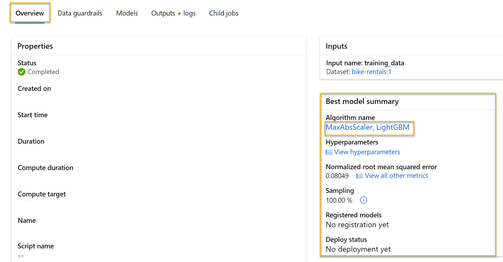

---
lab:
  title: 探索 Azure ML 中的自动化机器学习
---

# 探索 Azure ML 中的自动化机器学习

> 注意：要完成此实验室，需要一个你在其中具有管理权限的 [Azure 订阅](https://azure.microsoft.com/free?azure-portal=true)。

在本练习中，你将使用历史自行车租赁详细信息数据集来训练一个模型，该模型根据季节和气象特征预测给定日期应预期的自行车租赁数。

## 创建 Azure 机器学习工作区  

1. 使用 Microsoft 凭据登录 [Azure 门户](https://portal.azure.com?azure-portal=true)。

1. 选择“+ 创建资源”，搜索“机器学习”，然后通过 Azure 机器学习计划创建新的 Azure 机器学习资源。 使用以下设置：
    - **订阅**：Azure 订阅。
    - **资源组**：创建或选择资源组。
    - **工作区名称**：输入工作区的唯一名称。
    - **区域**：选择离你最近的地理区域。
    - **存储帐户**：记下要为工作区创建的默认新存储帐户。
    - **密钥保管库**：记下要为工作区创建的默认新密钥保管库。
    - **Application Insightss**：记下要为工作区创建的默认新 Application Insights 资源。
    - **容器注册表**：无（第一次将模型部署到容器时，将自动创建一个）。

1. 依次选择“查看 + 创建”、“创建”。   等待工作区创建完成（可能需要几分钟时间），然后转到部署的资源。

1. 选择“启动工作室”（或打开新的浏览器标签页并导航到 [https://ml.azure.com](https://ml.azure.com?azure-portal=true)，然后使用 Microsoft 帐户登录 Azure 机器学习工作室）。

1. 关闭显示的任何消息。

1. 在 Azure 机器学习工作室中，应会看到新创建的工作区。 如果不是这样，请在左侧菜单中选择 Azure 目录。 然后，从新的左侧菜单中选择“工作区”，其中列出了与目录关联的所有工作区，并选择为此练习创建的工作区。

> 注意：本模块是使用 Azure 机器学习工作区的模块之一，包括 [Microsoft Azure AI 基础知识：了解适用于机器学习的可视化工具](https://docs.microsoft.com/learn/paths/create-no-code-predictive-models-azure-machine-learning/)学习路径中的其他模块。 如果你使用的是自己的 Azure 订阅，可以考虑创建一次工作区，并在其他模块中重复使用它。 只要订阅中存在 Azure 机器学习工作区，你的 Azure 订阅就要支付少量数据存储费用，因此，我们建议在不再需要 Azure 机器学习工作区时删除它。

## 创建计算

1. 在 [Azure 机器学习工作室](https://ml.azure.com?azure-portal=true)中，选择左上角的 &#8801; 图标（看起来像叠起来的三条线的菜单图标）可查看界面中的各个页面（可能需要将屏幕大小最大化）。 你可以使用左侧窗格中的这些页面来管理工作区中的资源。 选择“计算”页（在“管理”下） 。

1. 在“计算”页中，选择“计算群集”选项卡，然后添加具有以下设置的新计算群集 。 它将用于训练机器学习模型：
    - **位置**：选择与工作区相同的位置。如果未列出该位置，请选择最靠近你的位置。
    - **虚拟机层**：专用
    - **虚拟机类型**：CPU
    - **虚拟机大小**：
        - 选择“从所有选项中选择”
        - 搜索并选择“Standard_DS11_v2”
    - 选择“下一步”
    - **计算名称**：输入唯一名称。
    - 节点数下限：0
    - **节点数上限**：2
    - **缩减前的空闲秒数**：120
    - 启用 SSH 访问：不启用
    - 选择“创建”

> 注意：计算实例和群集是基于标准 Azure 虚拟机映像的。 对于本模块，建议使用 Standard_DS11_v2 映像以实现成本和性能的最佳平衡。 如果你的订阅配额不包含此映像，请选择其他映像；但请注意，较大的映像可能会产生较高的成本，而较小的映像可能不足以完成任务。 或者，让 Azure 管理员扩展配额。

创建计算群集需要一些时间。 等待时可转到下一步。

## 创建数据资产

1. 在 Web 浏览器的 https://aka.ms/bike-rentals[](https://aka.ms/bike-rentals?azure-portal=true) 中查看以逗号分隔的数据。

1. 在 [Azure 机器学习工作室](https://ml.azure.com?azure-portal=true)中，通过选择屏幕左上角的菜单图标展开左窗格。 查看“数据”页（在“资产”下）。 “数据”页包含计划在 Azure ML 中使用的特定数据文件或表。 也可以从此页面创建数据集。

1. 在“数据”页的“数据资产”选项卡下，选择“+ 创建”  。 然后为数据资产配置以下设置：
    * **数据类型**：
        * **名称**：bike-rentals
        * **说明**：自行车租赁数据
        * 数据集类型：表格
    * **数据源**：来自 Web 文件
    * **Web URL**：
        * Web URL：[https://aka.ms/bike-rentals](https://aka.ms/bike-rentals?azure-portal=true)
        * **跳过数据验证**：不选择
    * 设置：
        * **文件格式**：分隔
        * **分隔符**：逗号
        * **编码**：UTF-8
        * 列标题：只有第一个文件有标题
        * **跳过行**：无
        *               数据集包含多行数据：不选择
    * **架构**：
        * 包含除“路径”以外的所有列
        * 查看自动检测的类型
    * **审阅**
        * 选择“创建”

1. 创建数据集之后，打开它并查看“浏览”页面，以查看数据示例。 此数据包含自行车租赁的历史特征和标签。

> **引文**：此数据派生自 [Capital Bikeshare](https://www.capitalbikeshare.com/system-data)，并根据已发布数据[许可协议](https://www.capitalbikeshare.com/data-license-agreement)使用。

## 运行自动化机器学习作业

按照后续步骤运行作业，该作业使用自动化机器学习来训练预测自行车租赁的回归模型。

1. 在 [Azure 机器学习工作室](https://ml.azure.com?azure-portal=true)中，查看“自动化 ML”页（位于“创作”下） 。

1. 通过以下设置创建自动化 ML 作业：
    - **选择数据资产**：
        - **数据集**：bike-rentals
    - **配置作业**：
        - **新建试验名称**：mslearn-bike-rental
        - **目标列**：租赁（这是模型要训练来预测的标签）
        - **选择 Azure ML 计算群集**：你之前创建的计算群集。
    - 选择任务和设置： 
        - **任务类型**：回归（模型预测数值） 

    

    请注意，在任务类型下有“查看其他配置设置”和“查看特征化设置” 。 现在来配置这些设置。

    - **其他配置设置：**
        - **主要指标**：选择“标准均方根误差”
        - **说明最佳模型**：已选择 - 此选项会导致自动化机器学习计算最佳模型的特征重要性，使确定每个要素对预测标签的影响成为可能。
        -               使用所有受支持的模型：未选择。<u></u> 你将限制作业，仅尝试一些特定的算法。
        - **允许的模型**：仅选择 RandomForest 和 LightGBM - 通常，你想尽可能多地尝试，但添加的每个模型都会增加运行作业所需的时间。* *

        
        - **退出条件**：
            - **训练作业时间（小时）** ：0.5 - 最多 30 分钟后结束作业。
            - **指标分数阈值**：0.085 - 如果模型达到标准均方根误差指标分数（0.085 或更低），作业会结束。
        - **并发**：不更改
    - **特征化设置**：
        - **启用特征化**：已选择 - 在训练之前自动预处理特征。

    单击“下一步”转到下一个选择窗格。

    - 选择验证和测试类型
        - **验证类型**：自动
        - **测试数据集(预览版)** ：不需要测试数据集

1. 自动化机器学习作业详细信息提交完成后，它会自动启动。

1. 请等待作业完成。 这可能需要一段时间 - 这段时间正好可以喝杯咖啡休息一下！

## 查看最佳模型

1. 在自动化机器学习作业的“概述”选项卡上，记下最佳模型摘要。
    

    > 注意：你可能会在状态下看到消息“警告: 已达到用户指定的退出分数...”。 这是预期的消息。 请继续执行下一步。  
1. 选择最佳模型的“算法名称”下的文本，以查看其详细信息。

1. 在“标准均方根误差”值旁边，选择“查看所有其他指标”以查看回归模型的其他可能评估指标的值。

    

1. 选择“指标”选项卡，然后选择“残差”和“predicted_true”图标（如果尚未选择）。 
    

    查看显示模型性能的图表。 第一个图表以直方图的形式显示残差（预测值与实际值之间的差），第二个图表将预测值与真实值进行比较。

1. 选择“说明”选项卡。选择说明 ID，然后选择“聚合特征重要性”。  此图表显示了数据集中每个功能对标签预测的影响，如：

    

## 部署预测服务

1. 在 [Azure 机器学习工作室](https://ml.azure.com?azure-portal=true)的“自动化 ML”页上，选择自动化机器学习作业。

1. 在“概述”选项卡上，选择最佳模型的算法名称。

    

1. 在“模型”选项卡上，选择“部署”按钮并使用“Web 服务”选项通过以下设置部署模型  ：
    - **名称**：predict-rentals
    - **说明**：预测自行车租赁
    - **计算类型**：Azure 容器实例
    - **启用身份验证**：选定

1. 等待部署开始 - 这可能需要几秒钟。

1. 在 Azure 机器学习工作室的左侧菜单中，选择“终结点”，然后打开“predict-rentals”实时终结点。
1. 等待“部署状态”更改为“正常”- 这可能需要几分钟时间。

## 测试已部署的服务

现在，可以测试已部署的服务。

1. 在“predict-rentals”实时终结点页上，查看“测试”选项卡。

1. 在“输入数据以测试终结点”窗格中，将模板 JSON 替换为以下输入数据：

    ```JSON
    {
      "Inputs": { 
        "data": [
          {
            "day": 1,
            "mnth": 1,   
            "year": 2022,
            "season": 2,
            "holiday": 0,
            "weekday": 1,
            "workingday": 1,
            "weathersit": 2, 
            "temp": 0.3, 
            "atemp": 0.3,
            "hum": 0.3,
            "windspeed": 0.3 
          }
        ]    
      },   
      "GlobalParameters": 1.0
    }
    ```

1. 单击“测试”按钮。

1. 查看测试结果，其中包括根据输入特征预测的租赁次数。 测试窗格采用输入数据，然后使用训练的模型返回预测的租赁次数。

    

我们来回顾一下你的操作。 使用历史自行车租赁数据的数据集来训练模型。 该模型基于季节和气象特征预测给定日的自行车租赁数。 这种情况下，标签是自行车的租赁数。

你刚刚测试了一个服务，该服务已准备好通过“使用”选项卡中的凭据连接到客户端应用程序。我们将在这里结束本实验室。 欢迎继续使用刚刚部署的服务进行试验。

## 清理

你创建的 Web 服务托管于“Azure 容器实例”中。 如果不打算进一步试验它，应删除终结点以避免产生不必要的 Azure 使用量。 还应删除计算群集。

1. 在 [Azure 机器学习工作室](https://ml.azure.com?azure-portal=true)的“终结点”选项卡上，选择“predict-rentals”终结点。 然后选择“删除”，并确认是否要删除该终结点。
2. 在“计算”页上的“计算群集”选项卡上，选择计算实例，然后选择“删除”  。

> 注意：删除计算可确保不会向你的订阅收取计算资源的费用。 但是，只要订阅中存在 Azure 机器学习工作区，就会向你收取少量数据存储费用。 如果已完成对 Azure 机器学习的探索，可以删除 Azure 机器学习工作区和关联的资源。 但是，如果计划完成本系列中任何其他实验室，则需要重新创建它。
>
> 删除工作区的步骤：
> 1. 在 [Azure 门户](https://portal.azure.com?azure-portal=true)的“资源组”页中，打开在创建 Azure 机器学习工作区时指定的资源组。
> 2. 单击“删除资源组”，键入资源组名称以确认要删除资源组，然后选择“删除”。
