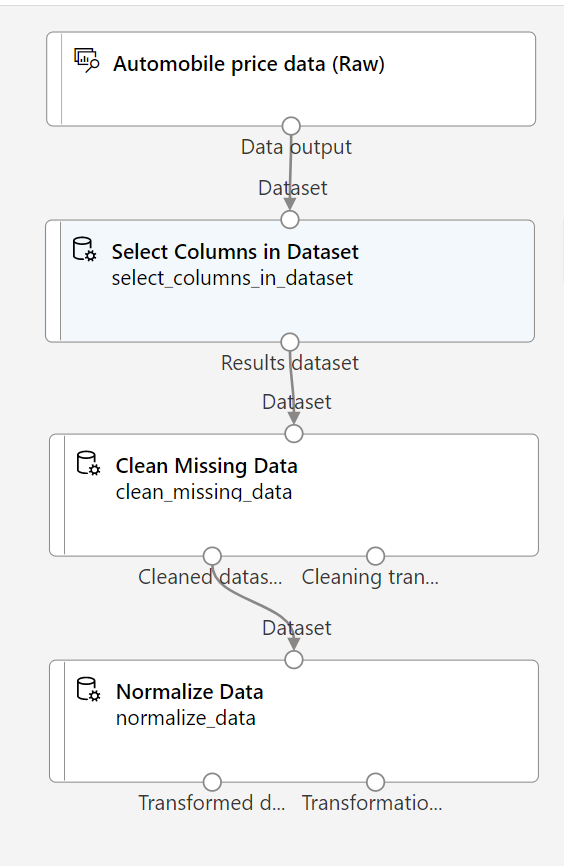

---
lab:
  title: 使用 Azure 机器学习设计器探索回归
---

# <a name="explore-regression-with-azure-machine-learning-designer"></a>使用 Azure 机器学习设计器探索回归

> 注意：要完成此实验室，需要一个你在其中具有管理权限的 [Azure 订阅](https://azure.microsoft.com/free?azure-portal=true)。

在本练习中，你将训练一种回归模型，该模型根据汽车的特征预测汽车的价格。

## <a name="create-an-azure-machine-learning-workspace"></a>创建 Azure 机器学习工作区  

1. 使用 Microsoft 凭据登录 [Azure 门户](https://portal.azure.com?azure-portal=true)。

1. 选择“+ 创建资源”，搜索“机器学习”，然后通过 Azure 机器学习计划创建新的 Azure 机器学习资源。 使用以下设置：
    - **订阅**：Azure 订阅。
    - **资源组**：创建或选择资源组。
    - **工作区名称**：输入工作区的唯一名称。
    - **区域**：选择离你最近的地理区域。
    - **存储帐户**：记下要为工作区创建的默认新存储帐户。
    - **密钥保管库**：记下要为工作区创建的默认新密钥保管库。
    - **Application Insightss**：记下要为工作区创建的默认新 Application Insights 资源。
    - 容器注册表：无（第一次将模型部署到容器时，将自动创建一个）

1. 依次选择“查看 + 创建”、“创建”。   等待工作区创建完成（可能需要几分钟时间），然后转到部署的资源。

1. 选择“启动工作室”（或打开新的浏览器标签页并导航到 [https://ml.azure.com](https://ml.azure.com?azure-portal=true)，然后使用 Microsoft 帐户登录 Azure 机器学习工作室）。

1. 在 Azure 机器学习工作室中，应会看到新创建的工作区。 如果未看到，请单击左侧菜单上的“Microsoft”。 然后从新的左侧菜单中选择“工作区”，其中列出了与你的订阅关联的所有工作区。 选择为本练习创建的工作区。 

> 注意：本模块是使用 Azure 机器学习工作区的模块之一，包括 [Microsoft Azure AI 基础知识：了解适用于机器学习的可视化工具](https://docs.microsoft.com/learn/paths/create-no-code-predictive-models-azure-machine-learning/)学习路径中的其他模块。 如果你使用的是自己的 Azure 订阅，可以考虑创建一次工作区，并在其他模块中重复使用它。 只要订阅中存在 Azure 机器学习工作区，你的 Azure 订阅就要支付少量数据存储费用，因此，我们建议在不再需要 Azure 机器学习工作区时删除它。

## <a name="create-compute"></a>创建计算

1. 在 [Azure 机器学习工作室](https://ml.azure.com?azure-portal=true)中，选择左上角的三条线可查看界面中的各个页面（可能需要将屏幕大小最大化）。 你可以使用左侧窗格中的这些页面来管理工作区中的资源。 选择“计算”页（在“管理”下） 。

1. 在“计算”页中，选择“计算群集”选项卡，然后添加具有以下设置的新计算群集来训练机器学习模型 ：
    - **位置**：选择与工作区相同的位置。如果未列出该位置，请选择最靠近你的位置。
    - **虚拟机层**：专用
    - **虚拟机类型**：CPU
    - **虚拟机大小**：
        - 选择“从所有选项中选择”
        - 搜索并选择“Standard_DS11_v2”
    - 选择“下一步”
    - 计算名称：输入唯一名称
    - 节点数下限：0
    - **节点数上限**：2
    - **缩减前的空闲秒数**：120
    - **启用 SSH 访问**：清除
    - 选择“创建”

> 注意：计算实例和群集是基于标准 Azure 虚拟机映像的。 对于本模块，建议使用 Standard_DS11_v2 映像以实现成本和性能的最佳平衡。 如果你的订阅配额不包含此映像，请选择其他映像；但请注意，较大的映像可能会产生较高的成本，而较小的映像可能不足以完成任务。 或者，让 Azure 管理员扩展配额。

创建计算群集需要一些时间。 等待时可转到下一步。

## <a name="create-a-pipeline-in-designer"></a>在设计器中创建管道 

1. 在 [Azure 机器学习工作室](https://ml.azure.com?azure-portal=true)中，通过选择屏幕左上角的三条线图标展开左窗格。 查看“设计器”页面（在“创建者”下），然后选择 + 创建新管道  。

1. 在屏幕右上角，选择“设置”。 如果“设置”窗格不可见，请选择顶部管道名称旁边的轮子图标。

1. 在“设置”中，必须指定要在其上运行管道的计算目标。 在“选择计算类型”下，选择“计算群集”。 然后在“选择 Azure ML 计算群集”下，选择之前创建的计算群集。

1. 在“设置”中的“草稿详细信息”下，将草稿名称（*管道创建日期***）更改为“汽车价格训练” 。

1. 选择“设置”窗格右上角的关闭图标以关闭窗格。 


## <a name="add-and-explore-a-dataset"></a>添加并浏览数据集

Azure 机器学习包括一个可用于此回归模型的示例数据集。

1. 如果面板尚未展开，请在左侧的管道名称旁边，选择箭头图标展开面板。 默认情况下，面板应打开“资源库”窗格，该窗格由面板顶部的书籍图标指示。 在窗格上有一个搜索栏，用于查找资产，还有两个按钮（“数据”和“组件”） 。

    

1. 单击“组件”。 搜索“汽车价格数据(原始数据)”数据集并将其放置在画布上。

1. 右键单击（在 Mac 上，按住 Ctrl 并单击）画布上的“汽车价格数据(原始数据)”数据集，然后单击“预览数据”。

1. 查看数据的“数据集输出”架构，注意可采用直方图的形式查看各列的分布情况。

1. 滚动到数据集的右侧，直到看到“价格”列（即模型预测的标签）。

1. 向左滚动并选择“normalized-losses”列标题。 然后，查看此列的统计信息。 请注意，此列中存在很多缺失值。 缺失值限制了列在预测“价格”标签时的有用性，因此建议将其从训练中排除。

1. 关闭“汽车价格数据(原始)结果可视化”窗口，以便可以在画布上看到数据集，如下所示：

    

## <a name="add-data-transformations"></a>添加数据转换

通常应用数据转换来准备用于建模的数据。 对于汽车价格数据，需要添加转换，以解决在浏览数据时发现的问题。

1. 在左侧的“资源库”窗格中，单击“组件”，其中包含可用于数据转换和模型训练的各种模块 。 还可以使用搜索栏快速查找模块。

1. 搜索“选择数据集中的列”模块，并将其拖到“汽车价格数据（原始数据）”模块下方的画布上。 然后将底部“汽车价格数据(原始)”模块的输出连接到顶部“选择数据集中的列”模块的输入，如下所示：

    

1. 双击“在数据集中选择列”模块以访问右侧的设置窗格。 选择“编辑列”。 然后在“选择列”窗口中，依次选择“按名称”和“全部添加”以添加所有列。 然后删除“normalized-losses”，因此最终的列选择如下所示：

    

1. 单击“保存”按钮。

在本练习的其余部分中，将按照步骤创建一个如下所示的管道：



按照剩下的步骤操作，在添加和配置所需模块时参考上图。

1. 在“资源库”中搜索“清理缺失的数据”模块，并将其放置在画布上的“在数据集中选择列”模块下  。 然后将“选择数据集中的列”模块的输出连接到“清理缺失的数据”模块的输入。

1. 双击“清理缺失的数据”模块，然后在右侧窗格中，单击“编辑列”。 然后在“要清理的列”窗口中，选择“使用规则”，在“包含”列表中选择“列名称”，在列名框中输入“bore”、“stroke”和“horsepower”，如下所示：      

    

1. 如果仍选中“清理缺失的数据”模块，请在右侧窗格中，设置以下配置设置：
    - **最小缺失值比率**：0.0
    - **最大缺失值比率**：1.0
    - **清理模式**：删除整行

    >提示：如果查看“bore”、“stroke”和“horsepower”列的统计信息，将看到许多缺失的值   。 这些列的缺失值少于“normalized-losses”，因此在从训练中排除存在缺失值的行后，它们在预测价格时可能仍然有用。

1. 在资源库中搜索“规范化数据”模块，并将其放置在“清理缺失的数据”模块下方的画布上。 然后，将最左侧“清理缺失的数据”模块的输出连接到“规范化数据”模块的输入。

1. 双击“规范化数据”模块以查看其参数窗格。 需要指定转换方法和要转换的列。 将转换方法设置为 MinMax。 通过选择“编辑列”来应用规则，使其包括以下列名：
    - **symboling**
    - **wheel-base**
    - **length**
    - width 
    - **height**
    - **curb-weight**
    - **engine-size**
    - **bore**
    - **stroke**
    - **compression-ratio**
    - **horsepower**
    - **peak-rpm**
    - **city-mpg**
    - **highway-mpg**

    

    >提示：如果比较“stroke”、“peak-rpm”和“city-mpg”列中的值，会发现它们都是用不同的尺度测量的，“peak-rpm”的较大值可能会使训练算法产生偏差，并且与具有较低值的列（如“stroke”）相比，可能会对该列产生过度依赖     。 通常，数据科学家通过规范化的数值列来减轻这种可能的偏差，使它们处于类似的比例。

## <a name="run-the-pipeline"></a>运行管道

若要应用数据转换，必须运行管道。

1. 确保管道如下图所示：

    

1. 选择“提交”，然后在计算群集上创建名为“mslearn-auto-training”的新试验 。

1. 等待运行完成，这可能需要 5 分钟或更长的时间。

    

    请注意，左侧面板现在位于“已提交的作业”窗格中。 你将知道运行何时完成，因为作业的状态将变更为“已完成”。 

1. 运行完成后，单击“作业详细信息”。 此时会打开一个新标签页，你将看到已完成的带有复选标记的组件，如下所示：

    

现已准备好用于进行模型训练的数据集。 关闭“作业详细信息”标签页以返回到管道。

## <a name="create-training-pipeline"></a>创建训练管道

使用数据转换准备数据之后，可以使用这些数据训练机器学习模型。 请完成以下步骤来扩展“汽车价格训练”管道。

1. 返回到以前单元中创建的“自动价格训练”管道（如果尚未打开）。

1. 在左侧“资源库”窗格中，搜索“拆分数据”模块并将其放置到“规范化数据”模块下方的画布上  。 然后将“规范化数据”模块的“转换后的数据集”（左侧）输出连接到“拆分数据”模块的输入。

    >提示：使用搜索栏快速查找模块。 

1. 双击“拆分数据”模块，并按如下所示配置其设置：
    * **拆分模式**：拆分行
    * **第一个输出数据集中的行部分**：0.7
    *               随机拆分：True
    * **随机种子**：123
    * **分层拆分**：False

1. 在“资源库”中，搜索“训练模型”模块，并将其放置到“拆分数据”模块下的画布上  。 然后将“拆分数据”模块的“结果数据集 1”（左侧）输出连接到“训练模型”模块的“数据集”（右侧）输入 。

1. 你训练的模型将预测“price”值，因此请选择“训练模型”模块，并修改其设置以将“标签列”设置为“price”（完全匹配大小写和拼写！）   

    模型将预测的“price”标签是一个数值，因此我们需要使用回归算法训练模型。

1. 在“资源库”中，搜索“线性回归”模块并将其放置在画布上，位置在“拆分数据”模块左侧和“训练模型”模块上方   。 然后将其输出连接到“训练模型”模块的“未训练模型”（左侧）输入。

    > 注意：可以使用多种算法来训练回归模型。 如需帮助选择一种算法，请查看 [Azure 机器学习设计器的机器学习算法速查表](https://aka.ms/mlcheatsheet?azure-portal=true)。

    若要测试已训练模型，我们需要使用它对在拆分原始数据时所保留的验证数据集进行评分（换句话说，在验证数据集中预测特征的标签）。
 
1. 在“资源库”中，搜索“评分模型”模块并将其放置在画布上，位置在“训练模型”模块下方  。 然后将“训练模型”模块的输出连接到“评分模型”模块的“已训练模型”（左侧）输入；并将“拆分数据”模块的“结果数据集 2”（右侧）输出拖动到“评分模型”模块的“数据集”（右侧）输入。

1. 确保管道如下图所示：

    

## <a name="run-the-training-pipeline"></a>运行训练管道

现在已准备好运行训练管道并训练模型。

1. 选择“提交”，并使用名为“mslearn-auto-training”的现有试验来运行管道。

1. 试验运行需要 5 分钟或更长时间才能完成。 试验运行完成后，单击“作业详细信息”。 你将转到新标签页。

1. 在新窗口中，右键单击“评分模型”模块，然后选择“预览数据”，然后选择“评分数据集”以查看结果。

1. 向右滚动，注意“price”列（其中包含标签的已知真实值）旁有一个名为“评分的标签”的新列（包含预测的标签值） 。

1. 关闭“评分模型结果可视化效果”标签页。

模型正在为“price”标签预测值，但其预测的可靠性如何呢？ 若要评估这一点，需要评估模型。

## <a name="evaluate-model"></a>评估模型

评估回归模型的一种方法是将预测的标签与验证数据集中的实际标签进行比较，以便在训练期间保留下来。 另一种方法是比较多个模型的性能。

1. 打开创建的“汽车价格训练”管道。

1. 在“资源库”中，搜索“评估模型”模块并将其放置到“评分模型”模块下的画布上，然后将“评分模型”模块的输出连接到“评估模型”模块的“已评分数据集”（左侧）输入     。

1. 确保管道如下所示：

    

1. 选择“提交”，并使用名为“mslearn-auto-training”的现有试验来运行管道。

1. 等待试验运行完成。

    

1. 试验运行完成后，选择“作业详细信息”，这将打开另一个标签页。找到并右键单击“评估模型”模块。  选择“预览数据”，然后选择“评估结果”。

    

1. 在 Evaluation_results 窗格中，查看回归性能指标：
    -               平均绝对误差 (MAE)
    -               均方根误差 (RMSE)
    -               相对平方误差 (RSE)
    -               相对绝对误差 (RAE)
    -               决定系数 (R<sup>2</sup>)
1. 关闭 Evaluation_results 窗格。

如果确定了满足你需求的评估指标模型，则可以准备将该模型用于新数据。

## <a name="create-and-run-an-inference-pipeline"></a>创建并运行推理管道

1. 在 Azure 机器学习工作室中，通过选择屏幕左上角的三条线展开左窗格。 单击“作业”（“资产”下）以查看运行的所有作业。 选择试验“mslearn-auto-training”，然后选择“mslearn-auto-training”管道。 

    

1. 找到画布上方的菜单，然后单击“创建推理管道”。 可能需要将屏幕放大到全屏，然后单击屏幕右上角的三个点图标“...”，以便在菜单中查找“创建推理管道”。  

    

1. 在“创建推理管道”下拉列表中，单击“实时推理管道”。 几秒钟后，将打开名为“自动价格训练实时推理”的新版本管道。

                  如果该管道不包括“Web 服务输入”和“Web 服务输出”模块，请返回“设计器”页面，然后重新打开“自动价格训练实时推理”管道**。

1. 将新管道重命名为“预测自动价格”，然后查看新管道。 它包含用于提交新数据的 Web 服务输入，以及用于返回结果的 Web 服务输出。 此管道中包含某些转换和训练步骤。 训练的模型将用于对新数据进行评分。

    在接下来的步骤 #5-9 中，将对推理管道进行以下更改：

    

   在后续步骤中修改管道时，可参考此图。

1. 推理管道假设新数据将与原始训练数据的架构匹配，因此包含训练管道中的“Automobile price data (Raw)”数据集。 然而，此输入数据包括了模型预测的“price”标签，这对于尚未进行价格预测的新车数据来说并不具有说服力。 删除此模块并将其替换为“手动输入数据”模块，该模块来自“数据输入和输出”部分，包含以下 CSV 数据，其中包括三辆车的不带标签的特征值（复制并粘贴整个文本块）：

    ```CSV
    symboling,normalized-losses,make,fuel-type,aspiration,num-of-doors,body-style,drive-wheels,engine-location,wheel-base,length,width,height,curb-weight,engine-type,num-of-cylinders,engine-size,fuel-system,bore,stroke,compression-ratio,horsepower,peak-rpm,city-mpg,highway-mpg
    3,NaN,alfa-romero,gas,std,two,convertible,rwd,front,88.6,168.8,64.1,48.8,2548,dohc,four,130,mpfi,3.47,2.68,9,111,5000,21,27
    3,NaN,alfa-romero,gas,std,two,convertible,rwd,front,88.6,168.8,64.1,48.8,2548,dohc,four,130,mpfi,3.47,2.68,9,111,5000,21,27
    1,NaN,alfa-romero,gas,std,two,hatchback,rwd,front,94.5,171.2,65.5,52.4,2823,ohcv,six,152,mpfi,2.68,3.47,9,154,5000,19,26
    ```

1. 将新的“手动输入数据”模块，作为“Web 服务输入”，连接到“选择数据集中的列”模块的相同的“数据集”输入。

1. 更改传入数据的架构以排除“price”字段之后，接下来需要删除其余模块中对该字段的任何显式使用。 选择“选择数据集中的列”模块，然后在“设置”窗格中编辑列以删除“price”字段。

1. 推理管道包括“评估模型”模块，此模块对于根据新数据进行预测没有用，因此可将其删除。

1. “评分模型”模块的输出包括所有输入特征以及预测的标签。 修改输出，使其只包含预测：
    - 删除“评分模型”模块与“Web 服务输出”之间的连接。
    - 从“Python 语言”部分添加一个“执行 Python 脚本”模块，将所有默认的 Python 脚本替换为以下代码（只选择“评分标签”列，并将其重命名为“predicted_price”）：

```Python
import pandas as pd

def azureml_main(dataframe1 = None, dataframe2 = None):

    scored_results = dataframe1[['Scored Labels']]
    scored_results.rename(columns={'Scored Labels':'predicted_price'},
                        inplace=True)
    return scored_results
```

    - 将“评分模型”模块的输出连接到“执行 Python 脚本”的“Dataset1”（最左侧）输入，并将“执行 Python 脚本”模块的输出连接到“Web 服务输出”。

1. 确认管道如下图所示：

    

1. 在计算群集上将管道作为名为“mslearn-auto-inference”的新试验提交。 试验可能需要一段时间才能完成运行。

1. 完成管道后，选择“作业详细信息”。 在新标签页中，右键单击“执行 Python 脚本”模块。 选择“预览数据”，然后选择“结果数据集”，查看输入数据中三辆车的预测价格。

1. 关闭可视化效果标签页。

推理管道根据汽车的特征来预测汽车的价格。 现在，你已准备好发布管道，以便客户端应用程序可以使用它。

## <a name="deploy-model"></a>部署模型

创建并测试用于实时推理的推理管道后，可将其作为服务发布以供客户端应用程序使用。

> 注意：在此练习中，需要将 Web 服务部署到 Azure 容器实例 (ACI) 中。 这种类型的计算是动态创建的，对于开发和测试很有用。 对于生产，你应创建一个推理群集，让它提供一个 Azure Kubernetes 服务 (AKS) 群集来提供更好的可伸缩性和安全性。

## <a name="deploy-a-service"></a>部署服务

1. 查看在上一个单元中创建的“预测自动价格”推理管道。

1. 在左侧窗格中选择“作业详细信息”，这将打开一个新标签页。

    

1. 在新标签页中，选择“部署”。

    

1. 在配置屏幕中，使用以下设置选择“部署新的实时终结点”：
    -  名称：predict-auto-price
    -                描述：自动执行价格回归
    - **计算类型**：Azure 容器实例

1. 等待几分钟，以便部署 Web 服务。 部署状态显示在设计器界面的左上方。

## <a name="test-the-service"></a>测试服务

1. 在“终结点”页面上，打开“predict-auto-price”实时终结点。

    

1. 当“predict-auto-price”终结点打开时，选择“测试”选项卡。我们将使用它来测试模型与新数据。 在“输入数据以测试实时终结点”下，删除目前的数据。 复制以下数据并粘贴到数据部分：  

    ```json
    {
    "Inputs": {
                "WebServiceInput0":
                [
                    {
                        "symboling": 3,
                        "normalized-losses": 1.0,
                        "make": "alfa-romero",
                        "fuel-type": "gas",
                        "aspiration": "std",
                        "num-of-doors": "two",
                        "body-style": "convertible",
                        "drive-wheels": "rwd",
                        "engine-location": "front",
                        "wheel-base": 88.6,
                        "length": 168.8,
                        "width": 64.1,
                        "height": 48.8,
                        "curb-weight": 2548,
                        "engine-type": "dohc",
                        "num-of-cylinders": "four",
                        "engine-size": 130,
                        "fuel-system": "mpfi",
                        "bore": 3.47,
                        "stroke": 2.68,
                        "compression-ratio": 9,
                        "horsepower": 111,
                        "peak-rpm": 5000,
                        "city-mpg": 21,
                        "highway-mpg": 27
                    }
                ]
            },
    "GlobalParameters": {}
    }
    ```

1. 选择“测试”。 在屏幕右侧，应会看到输出“predicted_price”。 输出是使用数据中指定的特定输入特征预测的汽车价格。 

    

我们来回顾一下你的操作。 你清理并转换了汽车数据的数据集，然后使用汽车特征来训练模型。 该模型预测汽车的价格，即标签。

你还测试了一项服务，该服务已准备好通过“使用”选项卡中的凭据连接到客户端应用程序。我们将在这里结束本实验室。 欢迎继续使用刚刚部署的服务进行试验。

## <a name="clean-up"></a>清理

你创建的 Web 服务托管于“Azure 容器实例”中。 如果不打算进一步试验它，应删除终结点以避免产生不必要的 Azure 使用量。 此外，还应停止计算实例，直到再次使用该实例。

1. 在 [Azure 机器学习工作室](https://ml.azure.com?azure-portal=true)的“终结点”选项卡上，选择“predict-auto-price”终结点。 然后选择“删除”，并确认是否要删除该终结点。

1. 在“计算”页上的“计算群集”选项卡上，选择计算群集，然后选择“删除”  。

>注意：停止计算可确保不会向你的订阅收取计算资源的费用。 但是，只要订阅中存在 Azure 机器学习工作区，就会向你收取少量数据存储费用。 如果已完成对 Azure 机器学习的探索，可以删除 Azure 机器学习工作区和关联的资源。 但是，如果计划完成本系列中任何其他实验室，则需要重新创建它。
>
> 删除工作区的步骤：
>
> 1. 在 [Azure 门户](https://portal.azure.com?azure-portal=true)的“资源组”页中，打开在创建 Azure 机器学习工作区时指定的资源组。
> 1. 单击“删除资源组”，键入资源组名称以确认要删除资源组，然后选择“删除”。
