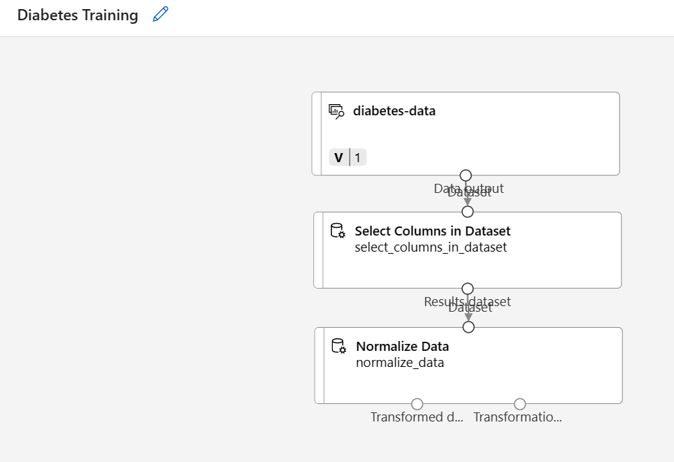

---
lab:
  title: 使用 Azure 机器学习设计器探索分类
---

# 使用 Azure 机器学习设计器探索分类

> 注意：要完成此实验室，需要一个你在其中具有管理权限的 [Azure 订阅](https://azure.microsoft.com/free?azure-portal=true)。

## 创建 Azure 机器学习工作区  

1. 使用 Microsoft 凭据登录 [Azure 门户](https://portal.azure.com?azure-portal=true)。

1. 选择“+ 创建资源”，搜索“机器学习”，然后通过 Azure 机器学习计划创建新的 Azure 机器学习资源。 使用以下设置：
    - **订阅**：Azure 订阅。
    - **资源组**：创建或选择资源组。
    - **工作区名称**：输入工作区的唯一名称。
    - **区域**：选择离你最近的地理区域。
    - **存储帐户**：记下要为工作区创建的默认新存储帐户。
    - **密钥保管库**：记下要为工作区创建的默认新密钥保管库。
    - **Application Insightss**：记下要为工作区创建的默认新 Application Insights 资源。
    - 容器注册表：无（第一次将模型部署到容器时，将自动创建一个）

1. 依次选择“查看 + 创建”、“创建”。   等待工作区创建完成（可能需要几分钟时间），然后转到部署的资源。

1. 选择“启动工作室”（或打开新的浏览器标签页并导航到 [https://ml.azure.com](https://ml.azure.com?azure-portal=true)，然后使用 Microsoft 帐户登录 Azure 机器学习工作室）。

1. 在 Azure 机器学习工作室中，应会看到新创建的工作区。 如果不是这样，请在左侧菜单中选择 Azure 目录。 然后，从新的左侧菜单中选择“工作区”，其中列出了与目录关联的所有工作区，并选择为此练习创建的工作区。

> 注意：本模块是使用 Azure 机器学习工作区的模块之一，包括 [Microsoft Azure AI 基础知识：了解适用于机器学习的可视化工具](https://docs.microsoft.com/learn/paths/create-no-code-predictive-models-azure-machine-learning/)学习路径中的其他模块。 如果你使用的是自己的 Azure 订阅，可以考虑创建一次工作区，并在其他模块中重复使用它。 只要订阅中存在 Azure 机器学习工作区，你的 Azure 订阅就要支付少量数据存储费用，因此，我们建议在不再需要 Azure 机器学习工作区时删除它。

## 创建计算

1. 在 [Azure 机器学习工作室](https://ml.azure.com?azure-portal=true)中，选择左上角的 &#8801; 图标（看起来像叠起来的三条线的菜单图标）可查看界面中的各个页面（可能需要将屏幕大小最大化）。 你可以使用左侧窗格中的这些页面来管理工作区中的资源。 选择“计算”页（在“管理”下） 。

1. 在“计算”页中，选择“计算群集”选项卡，然后添加具有以下设置的新计算群集 。 它将用于训练机器学习模型：
    - **位置**：选择与工作区相同的位置。如果未列出该位置，请选择最靠近你的位置。
    - **虚拟机层**：专用
    - **虚拟机类型**：CPU
    - **虚拟机大小**：
        - 选择“从所有选项中选择”
        - 搜索并选择“Standard_DS11_v2”
    - 选择“下一步”
    - **计算名称**：输入唯一名称。
    - 节点数下限：0
    - **节点数上限**：2
    - **缩减前的空闲秒数**：120
    - **启用 SSH 访问**：清除
    - 选择“创建”

> 注意：计算实例和群集是基于标准 Azure 虚拟机映像的。 对于本模块，建议使用 Standard_DS11_v2 映像以实现成本和性能的最佳平衡。 如果你的订阅配额不包含此映像，请选择其他映像；但请注意，较大的映像可能会产生较高的成本，而较小的映像可能不足以完成任务。 或者，让 Azure 管理员扩展配额。

创建计算群集需要一些时间。 等待时可转到下一步。


## 创建数据集

1. 在 [Azure 机器学习工作室](https://ml.azure.com?azure-portal=true)中，通过选择屏幕左上角的菜单图标展开左窗格。 选择“数据”页面（在“资产”下） 。 “数据”页包含计划在 Azure ML 中使用的特定数据文件或表。 也可以从此页面创建数据集。

1. 在“数据”页面的“数据资产”选项卡下，选择“+ 创建”  。 然后为数据资产配置以下设置：
    - **数据类型**：
        - 名称：糖尿病数据
        - 说明：糖尿病数据
        - 数据集类型：表格
    - 数据源：来自 Web 文件
    - **Web URL**：
        - **Web URL**：https://aka.ms/diabetes-data
        - **跳过数据验证**：不选择
    - 设置：
        - **文件格式**：分隔
        - **分隔符**：逗号
        - **编码**：UTF-8
        - 列标题：只有第一个文件有标题
        - **跳过行**：无
        -               数据集包含多行数据：不选择
    - **架构**：
        - 包含除“路径”以外的所有列
        - 查看自动检测的类型
    - **审阅**
        - 选择“创建”

1. 创建数据集之后，打开它并查看“浏览”页面，以查看数据示例。 此数据表示已对糖尿病进行测试的患者的详细信息。

## 在设计器中创建管道，并将数据加载到画布

若要开始使用 Azure 机器学习设计器，首先必须创建管道并添加要使用的数据集。

1. 在 [Azure 机器学习工作室](https://ml.azure.com?azure-portal=true)的左窗格中，选择“设计器”项（在“创作”下），然后选择 + 创建新管道。

1. 将草稿名称从“管道创建*日期*”更改为“糖尿病训练” 。

1. 然后在项目中，如果面板尚未展开，请选择左侧管道名称旁边的箭头图标来展开面板。 默认情况下，面板应打开“资源库”窗格，该窗格由面板顶部的书籍图标指示。 请注意，有一个搜索栏用于查找资产。 请注意两个按钮，“数据”和“组件” 。

    

1. 选择“数据”。 搜索“diabetes-data”数据集并将其放置在画布上。

1. 右键单击（在 Mac 上，按住 Ctrl 并单击）画布上的“diabetes-data”数据集，然后选择“预览数据” 。

1. 在“配置文件”选项卡中查看 "配置文件" 选项卡中的数据架构，注意可以直方图的形式查看各列的分布情况。

1. 向下滚动并选择“糖尿病”列的列标题，请注意，它包含 0 和 1 两个值。 这些值表示模型将预测的标签的两种可能类，值为 0 意味着患者没有糖尿病，值为 1 意味着患者有糖尿病。

1. 向上滚动并查看其他列，这些列表示将用于预测标签的特征。 请注意，其中大多数列是数值，但每个特征都具有自己的数值范围。 例如，“Age” 值的范围为 21 到 77，而 “DiabetesPedigree” 值的范围为 0.078 到 2.3016。 训练机器学习模型时，有时可能较大值在得到的预测函数中占主导地位，从而减少数值范围较小的特征的影响。 通常，数据科学家通过规范化的数值列来减轻这种可能的偏差，使它们处于类似的规模。

1. 关闭“DataOutput”选项卡，以便可以在画布上看到该数据集，如下所示：

    

## 添加转换

通常需要先对数据应用某些预处理转换，然后才能训练模型。

1. 在左侧的“资源库”窗格中，选择“组件”（其中包含可用于数据转换和模型训练的各种模块） 。 还可以使用搜索栏快速查找模块。

    

1. 找到“选择数据集中的列”模块，并将其放置在画布上“diabetes-data”数据集的下方 。 然后，将 diabetes-data 数据集底部的输出连接到“选择数据集中的列”模块顶部的输入，如下所示 。

1. 双击“在数据集中选择列”模块以访问右侧的设置窗格。 选择“编辑列”。 然后在“选择列”窗口中，选择“按名称”和“添加全部列”。 然后删除 PatientID 并单击“保存” 。

1. 找到“规范化数据”模块，并将其放置在画布上“选择数据集中的列”模块的下方 。 然后，将“选择数据集中的列”模块底部的输出连接到“规范化数据”模块顶部的输入，如下所示 ：

    

1. 双击“规范化数据”模块以查看其设置，请注意，需要指定转换方法和要转换的列。

1. 将转换方法设置为 MinMax，并将“选中时使用 0 作为常数列”设置为 True。 使用“编辑列”编辑列以进行转换。 选择列“包含规则”，复制并粘贴包含列名称下的以下列表：  

```
Pregnancies, PlasmaGlucose, DiastolicBloodPressure, TricepsThickness, SerumInsulin, BMI, DiabetesPedigree, Age
```


单击“保存”并关闭选择框。

数据转换会规范化数值列，以将其置于相同的数值范围内，这有助于防止具有较大值的列在模型训练中占主导地位。 通常会应用一大串类似于下面这样的预处理转换，以便使数据准备好进行训练，但在本练习中，我们会使内容保持简单。

## 运行管道

若要应用数据转换，需要将管道作为试验运行。

1. 选择页面顶部的“配置和提交”，打开“设置管道作业”对话框 。

1. 在“基本信息”页面上，选择“新建”，并将试验名称设置为“mslearn-diabetes-training”，然后选择“下一步”   。

1. 在“输入和输出”页面上，选择“下一步”，不进行任何更改 。

1. “运行时设置”页面上会出现错误，因为你没有用于运行管道的默认计算。 在“选择计算类型”下拉列表中，选择“计算群集”，然后在“选择 Azure ML 计算群集”下拉列表中选择最近创建的计算群集。

1. 选择“查看 + 提交”查看管道作业，然后选择“提交”以运行训练管道 。

1. 请等待几分钟，以便运行完成。 可以通过选择“资产”下的“作业”来查看作业的状态 。 在此处，选择“mslearn-diabetes-training”试验，然后选择“糖尿病训练”作业 。

## 查看转换后的数据

运行完成后，数据集现已准备好进行模型训练。

1. 右键单击（在 Mac 上，按住 Ctrl 并单击）画布上的“规范化数据”模块，然后选择“预览数据” 。 选择“转换后的数据集”。

1. 查看数据，请注意，所选的数字列已规范化为通用数值范围。

1. 关闭规范化的数据结果可视化效果。 返回到上一标签页。

使用数据转换准备数据之后，可以使用这些数据训练机器学习模型。

## 添加训练模块

常见做法是使用数据的子集来训练模型，同时保留一些数据用于测试已训练模型。 这样可以将模型预测的标签与原始数据集中的实际已知标签进行比较。

在本练习中，你将完成以下步骤来扩展“糖尿病训练”管道，如下所示：


按照以下步骤操作，在添加和配置所需模块时使用上图进行参考。

1. 返回“设计器”页面，选择“糖尿病训练”管道 。

1. 在左侧“资源库”窗格中的“组件”中，搜索“拆分数据”模块并将其放置到“规范化数据”模块下方的画布上   。 然后将“规范化数据”模块的“转换后的数据集”（左侧）输出连接到“拆分数据”模块的输入。

    >提示：使用搜索栏快速查找模块。

1. 选择“拆分数据”模块，并按如下所示配置其设置：
    - **拆分模式**：拆分行
    - **第一个输出数据集中的行部分**：0.7
    -               随机拆分：True
    - **随机种子**：123
    - **分层拆分**：False

1. 在“资源库”中，搜索“训练模型”模块，并将其放置到“拆分数据”模块下的画布上  。 然后将“拆分数据”模块的“结果数据集 1”（左侧）输出连接到“训练模型”模块的“数据集”（右侧）输入 。

1. 我们训练的模型将预测“Diabetic”值，因此请选择“训练模型”模块，并修改其设置以将“标签列”设置为“Diabetic”。

    模型将预测的“Diabetic”标签是一个类（0 或 1），因此我们需要使用分类算法训练模型。 具体而言，有两个可能的类，因此我们需要二元分类算法。

1. 在“资源库”中，搜索“双类逻辑回归”模块并将其放置在画布上，位置在“拆分数据”模块左侧和“训练模型”模块上方   。 然后将其输出连接到“训练模型”模块的“未训练模型”（左侧）输入。

   若要测试已训练模型，我们需要使用它对在拆分原始数据时所保留的验证数据集进行评分（换句话说，在验证数据集中预测特征的标签）。

1. 在“资源库”中，搜索“评分模型”模块并将其放置在画布上，位置在“训练模型”模块下方  。 然后将“训练模型”模块的输出连接到“评分模型”模块的“已训练模型”（左侧）输入；并将“拆分数据”模块的“结果数据集 2”（右侧）输出连接到“评分模型”模块的“数据集”（右侧）输入。

## 运行训练管道

现在已准备好运行训练管道并训练模型。

1. 选择“配置和提交”，并使用名为“mslearn-diabetes-training”的现有试验来运行管道 。

1. 等待试验运行完成。 这可能需要 5 分钟或更长时间。

1. 通过选择“资产”下的“作业”来查看作业的状态 。 在此处，选择“mslearn-diabetes-training”试验，然后选择最近的“糖尿病训练”作业 。

1. 在新选项卡上，右键单击（在 Mac 上，按住 Ctrl 并单击）画布上的“评分模型”模块，选择“预览数据”，然后选择“评分数据集”以查看结果  。

1. 向右滚动，注意 Diabetic 列（其中包含标签的已知真实值）旁有一个名为 Scored Labels 的新列（包含预测的标签值）和 Scored Probabilities 列（包含介于 0 与 1 之间的概率值）。 这指示阳性预测的概率，因此大于 0.5 的概率会生成 1（糖尿病）的预测标签，而介于 0 与 0.5 之间的概率会生成预测标签 0（非糖尿病）。

1. 关闭“Scored_dataset”选项卡。

模型在为“Diabetic”标签预测值，但其预测的可靠性如何呢？ 若要评估这一点，需要评估模型。

你保留并用于对模型进行评分的验证数据包括标签的已知值。 因此，若要验证模型，可以在对验证数据集进行评分时将标签的真实值与预测的标签值进行比较。 基于此比较，可以计算各种描述模型性能的指标。

## 添加“评估模型”模块

1. 返回到“设计器”并打开创建的“糖尿病训练”管道 。

1. 在“资源库”中，搜索“评估模型”模块并将其放置到“评分模型”模块下的画布上，然后将“评分模型”模块的输出连接到“评估模型”模块的“已评分数据集”（左侧）输入     。

1. 确保管道如下所示：

    

1. 选择“配置和提交”，并使用名为“mslearn-diabetes-training”的现有试验来运行管道 。

1. 等待试验运行完成。

1. 通过选择“资产”下的“作业”来查看作业的状态 。 在此处，选择“mslearn-diabetes-training”试验，然后选择最近的“糖尿病训练”作业 。

1. 在新选项卡上，右键单击（在 Mac 上，按住 Ctrl 并单击）画布上的“评估模型”模块，选择“预览数据”，然后选择“评估结果”以查看性能指标  。 这些指标可帮助数据科学家评估模型基于验证数据进行预测的情况。

1. 向下滚动以查看模型的混淆矩阵。 观察每个可能类的预测值和实际值计数。 

1. 查看混淆矩阵左侧的指标，其中包括：
    -               准确度：换句话说，模型的糖尿病预测的正确比例是多少？
    -               精准率：换句话说，在所有模型预测患有糖尿病的患者中，模型正确预测的时间百分比。 
    - 召回率：换句话说，在所有实际患有糖尿病的患者中，模型正确识别了多少糖尿病病例？
    - F1 分数

1. 使用位于指标列表上方的“阈值”滑块。 尝试移动阈值滑块，并观察对混淆矩阵的影响。 如果将它一直移动到左侧 (0)，则召回率指标将变为 1，如果将它一直移动到右侧 (1)，则召回率指标将变为 0。

1. 查看“阈值”滑块上方的 ROC 曲线和 AUC 指标以及下面的其他指标。 若要了解此区域如何表示模型的性能，请设想从 ROC 图表左下角到右上角的直线对角线。 如果你只是对每个患者进行猜测或抛硬币，则这表示预期性能 - 你可能会期望其大约一半正确，一半错误，因此对角线下的面积表示 AUC 为 0.5。 如果模型的 AUC 高于二元分类模型，则该模型的性能优于随机推测。

1. 关闭“Evaluation_results”选项卡。

此模型的性能不是很好，部分原因是我们仅执行了最少的特征工程和预处理。 可以尝试不同的分类算法（如双类决策林），并比较结果。 可以将“拆分数据”模块的输出连接到多个“训练模型”和“评分模型”模块，并且可以将第二个“评分模型”模块连接到“评估模型”模块以查看并排比较。 练习的重点只是介绍分类和 Azure 机器学习设计器界面，而不是训练完美模型！

## 创建推理管道

1. 找到画布上方的菜单，然后选择“创建推理管道”。 可能需要将屏幕放大到全屏，然后单击屏幕右上角的三个点图标“...”，以便在菜单中查找“创建推理管道”。  

    

1. 在“创建推理管道”下拉列表中，选择“实时推理管道” 。 几秒钟后，将打开名为“糖尿病训练实时推理”的新版本管道。

1. 将新管道重命名为“预测糖尿病”，然后查看新管道。 此管道中包含某些转换和训练步骤。 训练的模型将用于对新数据进行评分。 管道还包含用于返回结果的 Web 服务输出。

    将对推理管道进行以下更改：

    

    - 为要提交的新数据添加“Web 服务输入”组件。
    - 将 diabetes-data 数据集替换为不包含标签列“Diabetic”的“手动输入数据”模块。
    - 编辑在“选择数据集中的列”模块中选择的列。
    - 删除“评估模型”模块。
    - 在 Web 服务输出之前插入“执行 Python 脚本”模块，以便仅返回患者 ID、预测的标签值和概率。

1. 对于从自定义数据集创建的模型，管道不会自动包含“Web 服务输入”组件。 在资源库中搜索“Web 服务输入”组件并将其放置在管道顶部。 将“Web 服务输入”组件的输出连接到画布上已有的“在数据集中选择列”组件 。

1. 推理管道假设新数据将与原始训练数据的架构匹配，因此包含训练管道中的 diabetes-data 数据集。 然而，此输入数据包括了模型预测的“Diabetic”标签，这并未包含在尚未进行糖尿病预测的新患者数据中。 删除此模块并用“手动输入数据”模块进行替换，包含以下 CSV 数据，其中包括三个新患者观察值的不带标签的特征值：

    ```CSV
    PatientID,Pregnancies,PlasmaGlucose,DiastolicBloodPressure,TricepsThickness,SerumInsulin,BMI,DiabetesPedigree,Age
    1882185,9,104,51,7,24,27.36983156,1.350472047,43
    1662484,6,73,61,35,24,18.74367404,1.074147566,75
    1228510,4,115,50,29,243,34.69215364,0.741159926,59
    ```

1. 将新的“手动输入数据”模块作为“Web 服务输入”连接到“选择数据集中的列”模块的相同“数据集”输入   。

1. 编辑“选择数据集中的列”模块。 从所选列中移除“Diabetic”。

1. 推理管道包括“评估模型”模块，此模块对于根据新数据进行预测没有用，因此可将其删除。

1. “评分模型”模块的输出包括所有输入特征以及预测的标签和概率分数。 若要将输出仅限于预测和概率，请执行以下操作：
    - 删除“评分模型”模块与“Web 服务输出”之间的连接。
    - 添加一个“执行 Python 脚本”模块，用以下代码替换所有默认的 Python 脚本（只选择“PatientID”、“评分的标签”和“评分的概率”列，并相应地重命名它们）：

    ```Python
    import pandas as pd
    
    def azureml_main(dataframe1 = None, dataframe2 = None):
    
        scored_results = dataframe1[['Scored Labels', 'Scored Probabilities']]
        scored_results.rename(columns={'Scored Labels':'DiabetesPrediction',
                                    'Scored Probabilities':'Probability'},
                            inplace=True)
        return scored_results
    ```

1. 将“评分模型”模块的输出连接到“执行 Python 脚本”的“Dataset1”（最左侧）输入，并将“执行 Python 脚本”模块的“结果数据集”（左侧）输出连接到“Web 服务输出”   。

1. 确认管道如下图所示：

    

1. 在计算群集上将管道作为名为 mslearn-diabetes-inference 的新试验运行。 试验可能需要一段时间才能运行。

1. 返回到“作业”选项卡。在此处，选择“mslearn-diabetes-inference”实验，然后选择“预测糖尿病”作业  。

1. 管道完成后，选择“执行 Python 脚本”模块。 选择“预览数据”并选择“结果数据集”以查看输入数据中三个患者观察值的预测标签和概率。 

你的推理管道会根据患者的特征预测患者是否有患糖尿病的风险。 现在，你已准备好发布管道，以便客户端应用程序可以使用它。

创建并测试用于实时推理的推理管道后，可将其作为服务发布以供客户端应用程序使用。

> 注意：在此练习中，需要将 Web 服务部署到 Azure 容器实例 (ACI) 中。 这种类型的计算是动态创建的，对于开发和测试很有用。 对于生产，你应创建一个推理群集，它提供一个可提供更好的可伸缩性和安全性的 Azure Kubernetes 服务 (AKS) 群集。

## 部署服务

1. 在“预测糖尿病”作业窗口的顶部，选择“部署”。

    

1. 在“设置实时终结点”中，选择“部署新的实时终结点”，并使用以下设置 ：
    - 名称：predict-diabetes
    -               说明：对糖尿病进行分类
    - **计算类型**：Azure 容器实例

1. 选择“部署”，然后等待 Web 服务部署完成 - 这可能需要几分钟。

## 测试服务

1. 在“终结点”页面上，打开“predict-diabetes”实时终结点。

    

1. 当“predict-diabetes”终结点打开时，选择“测试”选项卡。我们将使用它来测试模型与新数据。 在“输入数据以测试实时终结点”下，删除目前的数据。 复制以下数据并粘贴到数据部分：  

    ```JSON
    {
      "Inputs": {
        "input1":
          [
            { "PatientID": 1882185,
              "Pregnancies": 9,
              "PlasmaGlucose": 104,
              "DiastolicBloodPressure": 51,
              "TricepsThickness": 7,
              "SerumInsulin": 24,
              "BMI": 27.36983156,
              "DiabetesPedigree": 1.3504720469999998,
              "Age": 43 }
            ]
          },
      "GlobalParameters":  {}
    }
    ```

    > 注意：上述 JSON 为患者定义特征，并使用已创建的 predict-diabetes 服务预测糖尿病诊断 。

1. 选择“测试”。 在屏幕右侧，应会看到输出“DiabetesPrediction”。 如果预测患者患有糖尿病，则输出为 1；如果预测患者没有糖尿病，则输出为 0。  

    

    你刚刚测试了一个服务，该服务已准备好通过“使用”选项卡中的凭据连接到客户端应用程序。我们将在这里结束本实验室。 欢迎继续使用刚刚部署的服务进行试验。

## 清理

你创建的 Web 服务托管于“Azure 容器实例”中。 如果不打算进一步试验它，应删除终结点以避免产生不必要的 Azure 使用量。 还应删除计算群集。

1. 在 [Azure 机器学习工作室](https://ml.azure.com?azure-portal=true)的“终结点”选项卡上，选择“predict-diabetes”终结点。 然后选择“删除”，并确认是否要删除该终结点。

1. 在“计算”页上的“计算群集”选项卡上，选择计算群集，然后选择“删除”  。

>注意：删除计算可确保不会向你的订阅收取计算资源的费用。 但是，只要订阅中存在 Azure 机器学习工作区，就会向你收取少量数据存储费用。 如果已完成对 Azure 机器学习的探索，可以删除 Azure 机器学习工作区和关联的资源。 但是，如果计划完成本系列中任何其他实验室，则需要重新创建它。
>
> 删除工作区的步骤：
>
> 1. 在 [Azure 门户](https://portal.azure.com?azure-portal=true)的“资源组”页中，打开在创建 Azure 机器学习工作区时指定的资源组。
> 1. 单击“删除资源组”，键入资源组名称以确认要删除资源组，然后选择“删除”。
