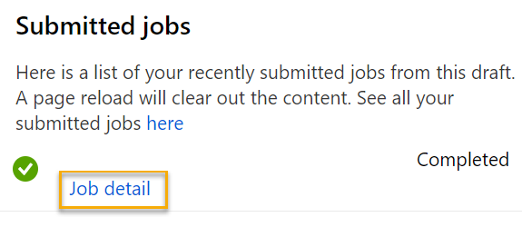

---
lab:
  title: 使用 Azure 机器学习设计器探索聚类分析
---

# <a name="explore-clustering-with-azure-machine-learning-designer"></a>使用 Azure 机器学习设计器探索聚类分析

> 注意：要完成此实验室，需要一个你在其中具有管理权限的 [Azure 订阅](https://azure.microsoft.com/free?azure-portal=true)。

## <a name="create-an-azure-machine-learning-workspace"></a>创建 Azure 机器学习工作区  

1. 使用 Microsoft 凭据登录 [Azure 门户](https://portal.azure.com?azure-portal=true)。

1. 选择“+ 创建资源”，搜索“机器学习”，然后通过 Azure 机器学习计划创建新的 Azure 机器学习资源。 使用以下设置：
    - **订阅**：Azure 订阅。
    - **资源组**：创建或选择资源组。
    - **工作区名称**：输入工作区的唯一名称。
    - **区域**：选择离你最近的地理区域。
    - **存储帐户**：记下要为工作区创建的默认新存储帐户。
    - **密钥保管库**：记下要为工作区创建的默认新密钥保管库。
    - **Application Insightss**：记下要为工作区创建的默认新 Application Insights 资源。
    - 容器注册表：无（第一次将模型部署到容器时，将自动创建一个）

1. 依次选择“查看 + 创建”、“创建”。   等待工作区创建完成（可能需要几分钟时间），然后转到部署的资源。

1. 选择“启动工作室”（或打开新的浏览器标签页并导航到 [https://ml.azure.com](https://ml.azure.com?azure-portal=true)，然后使用 Microsoft 帐户登录 Azure 机器学习工作室）。

1. 在 Azure 机器学习工作室中，应会看到新创建的工作区。 如果未看到，请单击左侧菜单上的“Microsoft”。 然后从新的左侧菜单中选择“工作区”，其中列出了与你的订阅关联的所有工作区。 选择为本练习创建的工作区。 

> 注意：本模块是使用 Azure 机器学习工作区的模块之一，包括 [Microsoft Azure AI 基础知识：了解适用于机器学习的可视化工具](https://docs.microsoft.com/learn/paths/create-no-code-predictive-models-azure-machine-learning/)学习路径中的其他模块。 如果你使用的是自己的 Azure 订阅，可以考虑创建一次工作区，并在其他模块中重复使用它。 只要订阅中存在 Azure 机器学习工作区，你的 Azure 订阅就要支付少量数据存储费用，因此，我们建议在不再需要 Azure 机器学习工作区时删除它。

## <a name="create-compute"></a>创建计算

1. 在 [Azure 机器学习工作室](https://ml.azure.com?azure-portal=true)中，选择左上角的三条线可查看界面中的各个页面（可能需要将屏幕大小最大化）。 你可以使用左侧窗格中的这些页面来管理工作区中的资源。 选择“计算”页（在“管理”下） 。

2. 在“计算”页中，选择“计算群集”选项卡，然后添加具有以下设置的新计算群集 。 它将用于训练机器学习模型：
    - **位置**：选择与工作区相同的位置。如果未列出该位置，请选择最靠近你的位置。
    - **虚拟机层**：专用
    - **虚拟机类型**：CPU
    - **虚拟机大小**：
        - 选择“从所有选项中选择”
        - 搜索并选择“Standard_DS11_v2”
    - 选择“下一步”
    - **计算名称**：输入唯一名称。
    - 节点数下限：0
    - **节点数上限**：2
    - **缩减前的空闲秒数**：120
    - **启用 SSH 访问**：清除
    - 选择“创建”

> 注意：计算实例和群集是基于标准 Azure 虚拟机映像的。 对于本模块，建议使用 Standard_DS11_v2 映像以实现成本和性能的最佳平衡。 如果你的订阅配额不包含此映像，请选择其他映像；但请注意，较大的映像可能会产生较高的成本，而较小的映像可能不足以完成任务。 或者，让 Azure 管理员扩展配额。

创建计算群集需要一些时间。 等待时可转到下一步。

## <a name="create-a-pipeline-in-designer"></a>在设计器中创建管道

若要开始使用 Azure 机器学习设计器，首先必须创建管道。

1. 在 [Azure 机器学习工作室](https://ml.azure.com?azure-portal=true)中，通过选择屏幕左上角的三条线图标展开左窗格。 查看“设计器”页面（在“创建者”下），然后选择加号创建新管道。

1. 在屏幕右上角，选择“设置”。 如果“设置”窗格不可见，请选择顶部管道名称旁边的轮子图标。

1. 在“设置”中，必须指定要在其上运行管道的计算目标。 在“选择计算类型”下，选择“计算群集”。 然后在“选择 Azure ML 计算群集”下，选择之前创建的计算群集。

1. 在“设置”中的“草稿详细信息”下，将草稿名称（*管道创建日期***）更改为“训练企鹅聚类分析” 。

1. 选择“设置”窗格右上角的关闭图标以关闭窗格，然后选择“保存” 。

    

## <a name="create-a-dataset"></a>创建数据集

在 Azure 机器学习中，用于模型训练和其他操作的数据通常封装在称为数据集的对象中。 在本模块中，你将使用一个数据集，其中包含对三种企鹅的观察值。

1. 在 [Azure 机器学习工作室](https://ml.azure.com?azure-portal=true)中，通过选择屏幕左上角的三条线展开左窗格。 查看“数据”页（在“资产”下）。 “数据”页包含计划在 Azure ML 中使用的特定数据文件或表。 也可以从此页面创建数据集。

1. 在“数据”页的“数据资产”选项卡下，选择“创建”  。 然后为数据资产配置以下设置：
    * **数据类型**：
        * **名称**：penguin-data
        * **说明**：企鹅数据
        * 数据集类型：表格
    * **数据源**：来自 Web 文件
    * **Web URL**：
        * **Web URL**：https://aka.ms/penguin-data
        * **跳过数据验证**：不选择
    * 设置：
        * **文件格式**：分隔
        * **分隔符**：逗号
        * **编码**：UTF-8
        * 列标题：只有第一个文件有标题
        * **跳过行**：无
        *               数据集包含多行数据：不选择
    * **架构**：
        * 包含除“路径”以外的所有列
        * 查看自动检测的类型
    * **审阅**
        * 选择“创建”

1. 创建数据集之后，打开它并查看”浏览“页面，以查看数据示例。 此数据表示构成企鹅的多个观察值的嘴峰（鸟喙）长度和深度、鳍状肢长度和体重的测量值。 数据集中有三种企鹅：阿德利企鹅、白眉企鹅和帽带企鹅。

> 注意：本练习中使用的企鹅数据集是 [Kristen Gorman 博士](https://www.uaf.edu/cfos/people/faculty/detail/kristen-gorman.php)和[长期生态研究网络](https://lternet.edu/)成员[南极洲帕默站](https://pal.lternet.edu/)收集并提供的数据的子集。

### <a name="load-data-to-canvas"></a>将数据加载到画布

1. 选择左侧菜单中的“设计器”，返回到管道。 在“设计器”页中，选择“训练企鹅聚类分析” 。

1. 如果面板尚未展开，请在左侧的管道名称旁边，选择箭头图标展开面板。 默认情况下，面板应打开“资源库”窗格，该窗格由面板顶部的书籍图标指示。 请注意，有一个搜索栏用于查找资产。 请注意两个按钮，“数据”和“组件” 。

    

1. 单击“数据”。 搜索企鹅数据数据集并将其放置在画布上。

1. 右键单击（在 Mac 上 Ctrl+单击）画布上的“penguin-data”数据集，然后单击“预览数据”。

1. 查看数据的配置文件架构，请注意，可采用直方图的形式查看各列的分布情况。 然后，选择“CulmenLength”列。 数据集应如下所示：

    

1. 请注意数据集的以下特征：

    - 此数据集包括以下列：
        - **CulmenLength**：企鹅鸟喙的长度（以毫米为单位）。
        - **CulmenDepth**：企鹅鸟喙的深度（以毫米为单位）。
        - **FlipperLength**：企鹅鳍状肢的长度（以毫米为单位）。
        - **BodyMass**：企鹅的体重（以克为单位）。
        - Species：种类指示器（0：“阿德利企鹅”、1：“白眉企鹅”、2：“帽带企鹅”）
    - “CulmenLength”列中有两个缺失值（“CulmenDepth”、“FlipperLength”和“BodyMass”列也有两个缺失值）。
    - 测量值采用不同的尺度（从几十毫米到几千克）。

1. 关闭数据集可视化效果，以便可在管道画布上查看数据集。

## <a name="apply-transformations"></a>应用转换

1. 在左侧的“资源库”窗格中，单击“组件”，其中包含可用于数据转换和模型训练的各种模块 。 还可以使用搜索栏快速查找模块。

    

1. 为了对企鹅的观察值进行聚类，我们将仅使用测量值；我们将忽略“species”列。 因此，搜索“选择数据集中的列”模块，将其放置到“penguin-data”模块下方的画布上，并将“penguin-data”模块底部的输出连接到“选择数据集中的列”模块顶部的输入，如下所示：

    

1. 双击“选择数据集中的列”模块，然后在右侧窗格中选择“编辑列”。 然后在“选择列”窗口中，选择“按名称”，并使用 + 链接选择列名称“CulmenLength”、“CulmenDepth”、“FlipperLength”和“BodyMass”；如下所示：

    

1. 关闭“选择数据集中的列”模块设置，以返回到设计器画布。

1. 在资源库中，搜索“清除缺失数据”模块并将其放置在画布上的“选择数据集中的列”模块下方，然后如下将它们连接起来：

    

1. 双击“清理缺失的数据”模块，然后在右侧的“设置”窗格中，单击“编辑列”。 然后，在“要清理的列”窗口中，选择“使用规则”并包括“所有列”；如下所示  ：

    

1. 如果仍选中“清理缺失的数据”模块，请在“设置”窗格中，设置以下配置设置：
    - **最小缺失值比率**：0.0
    - **最大缺失值比率**：1.0
    - **清理模式**：删除整行

1. 在资源库中搜索“规范化数据”模块，并将其放置在“清理缺失的数据”模块下方的画布上。 然后，将最左侧“清理缺失的数据”模块的输出连接到“规范化数据”模块的输入。

    

1. 双击“规范化数据”模块，然后在右侧窗格中，将“转换方法”设置为“MinMax”，然后选择“编辑列”。 然后，在“要转换的列”窗口中，选择“使用规则”并包括“所有列”；如下所示  ：

    

1. 关闭“规范化数据”模块设置，以返回到设计器画布。

## <a name="run-the-pipeline"></a>运行管道

若要应用数据转换，需要将管道作为试验运行。

1. 选择“提交”，然后在计算群集上将管道作为名为 mslearn-penguin-training 的新试验运行。

1. 等待运行完成。 这可能需要 5 分钟或更长时间。

    

    请注意，左侧面板现在位于“已提交的作业”窗格中。 你将知道运行何时完成，因为作业的状态将变更为“已完成”。

## <a name="view-the-transformed-data"></a>查看转换后的数据

1. 运行完成后，数据集现已准备好进行模型训练。 单击“作业详细信息”。 你将转到另一个标签页，其中会显示如下所示的模块：

    

1. 在新标签页中，右键单击“规范化数据”模块，选择“预览数据”，然后选择“转换后的数据集”以查看结果  。

1. 查看数据，注意“Species”列已删除，没有缺失值，并且所有四个特征的值均已规范化为常用尺度。

1. 关闭规范化的数据结果可视化效果。 返回上一个管道标签页。

现在，已选择并准备好要使用的数据集中特征，就可以使用它们来训练聚类分析模型了。

使用数据转换准备数据之后，可以使用这些数据训练机器学习模型。

## <a name="add-training-modules"></a>添加训练模块

按照以下步骤扩展“训练企鹅聚类分析”管道，如下所示：


按照以下步骤操作，在添加和配置所需模块时参考上图。

1. 打开“训练企鹅聚类分析”管道（如果尚未打开）。

1. 在左侧“资源库”窗格中，搜索“拆分数据”模块并将其放置到“规范化数据”模块下方的画布上  。 然后将左侧“规范化数据”模块的输出连接到“拆分数据”模块的输入。

    >提示：使用搜索栏快速查找模块。 

1. 选择“拆分数据”模块，并按如下所示配置其设置：
    * **拆分模式**：拆分行
    * **第一个输出数据集中的行部分**：0.7
    *               随机拆分：True
    * **随机种子**：123
    * **分层拆分**：False

1. 在“资源库”中，搜索“训练群集模型”模块，并将其放置到“拆分数据”模块下的在画布上。 然后将“拆分数据”模块的“结果数据集 1”（左侧）输出连接到“训练聚类分析模型”模块的“数据集”（右侧）输入。

1. 聚类分析模型应使用从原始数据集中选择的所有特征将聚簇分配给数据项。 双击“训练聚类分析模型”模块，然后在右侧窗格中，选择“编辑列” 。 使用“具有规则”选项来包括所有列，如下所示：

    

1. 我们正在训练的模型将使用这些特征来将数据分组为群集，因此我们需要使用聚类分析算法来训练模型。 在“资源库”中，搜索“K-Means 群集”模块并将其放置在 penguin-data 数据集左侧及“训练群集模型”模块上方的画布上。 然后将其输出连接到“训练聚类分析模型”模块的“未训练模型”（左侧）输入。

1. K-Means 算法将项分组为指定数量的群集，即 K 值。选择“K-Means 群集”模块，然后在右侧窗格中将“质心数”参数设置为“3”  。

    > 注意：可以将数据观察值（例如企鹅测量值）视为多维向量。 K 均值算法的工作原理是：
    > 1. 将 K 坐标初始化为 n 维空间中称为质心的随机选择点（其中 n 是特征向量中的维数）。
    > 2. 将特征向量绘制为同一空间中的点，并将每个点分配到距其最近的质心。
    > 3. 将质心移动到分配给它的点的中间（基于平均距离）。
    > 4. 移动后，将点重新分配到距其最近的质心。
    > 5. 重复步骤 3 和 4，直到群集分配稳定或完成指定的迭代次数。

   使用 70% 的数据训练聚类分析模型后，可以使用剩余的 30% 的数据通过使用模型将数据分配给群集来对其进行测试。

1. 在“资源库”中，搜索“向群集分配数据”模块并将其放置到“训练群集模型”模块下方的画布上。 然后，将“训练聚类分析模型”模块的“训练后的模型”（左侧）输出连接到“向群集分配数据”模块的“训练后的模型”（左侧）输入；并将“拆分数据”模块的“结果数据集 2”（右侧）输出连接到“向群集分配数据”模块的“数据集”（右侧）输入。

## <a name="run-the-training-pipeline"></a>运行训练管道

现在已准备好运行训练管道并训练模型。

1. 确保管道如下所示：

    

1. 选择“提交”，然后在计算群集上使用名为 mslearn-penguin-training 的现有试验运行管道。

1. 等待试验运行完成。 这可能需要 5 分钟或更长时间。

1. 试验运行完成后，选择“作业详细信息”。 在新标签页中，右键单击“向群集分配数据”模块，选择“预览数据”，然后选择“结果数据集”查看结果  。

1. 向下滚动，请注意“分配”列，其中包含每行分配的群集（0、1 或 2）。 此外，还有一些新列，指示从表示该行的点到每个群集的中心的距离 - 该点最接近的群集是为其分配的群集。

1. 关闭“向群集分配数据”可视化效果。 返回到管道标签页。

该模型测预企鹅观察值的群集，但其预测的可靠性如何呢？ 若要评估这一点，需要评估模型。

由于之前没有已知的群集分配的真实值，因此很难评估聚类分析模型。 成功的聚类分析模型是在每个群集中的项之间实现良好级别的隔离的模型，因此我们需要指标来帮助衡量此隔离。

## <a name="add-an-evaluate-model-module"></a>添加“评估模型”模块

1. 打开在以前单元中创建的“训练企鹅聚类分析”管道（如果尚未打开）。

1. 在资产库中，在画布上的“向群集分配数据”模块下搜索并放置一个“评估模型”模块。 将“向群集分配数据”模块的输出连接到“评估模型”模块的“评分数据集”（左侧）输入。

1. 确保管道如下所示：

    

1. 选择“提交”，并使用现有的 mslearn-penguin-training 试验来运行管道。

1. 等待试验运行完成。

1. 试验运行完成后，选择“作业详细信息”。 右键单击“评估模型”模块并选择“预览数据”，然后选择“评估结果”。 查看每个行中的指标：
    -               距其他中心的平均距离
    -               距群集中心的平均距离
    -               点数
    -               距群集中心的最大距离

1. 关闭“评估模型结果可视化效果”标签页。

现在，你拥有了有效的群集模型，可以使用它为推理管道中的群集分配新数据。

创建并运行管道以训练聚类分析模型后，可以创建推理管道。 推理管道使用模型向群集分配新的数据观察值。 此模型将构成可发布以供应用程序使用的预测服务的基础。

## <a name="create-an-inference-pipeline"></a>创建推理管道

1. 在 Azure 机器学习工作室中，通过选择屏幕左上角的三条线展开左窗格。 单击“作业”（“资产”下）以查看运行的所有作业。 选择试验“mslearn-penguin-training”，然后选择“训练企鹅聚类分析”管道 。 

1. 找到画布上方的菜单，然后单击“创建推理管道”。 可能需要将屏幕放大到全屏，然后单击屏幕右上角的三个点图标“...”，以便在菜单中查找“创建推理管道”。  

     

1. 在“创建推理管道”下拉列表中，单击“实时推理管道”。 几秒钟后，将打开名为“训练企鹅聚类分析实时推理”的新版本管道。

1. 导航到右上角菜单上的“设置”。 在“草稿详细信息”下，将新管道重命名为“预测企鹅群集”，然后查看新管道。 训练管道中的转换和聚类分析模型是此管道的一部分。 训练的模型将用于对新数据进行评分。 管道还包含用于返回结果的 Web 服务输出。 

    将对推理管道进行以下更改：

    

    - 为要提交的新数据添加“Web 服务输入”组件。
    - 将 penguin-data 数据集替换为不包含“Species”列的“手动输入数据”模块。
    - 删除“选择数据集中的列”模块，该模块现在是冗余的。
    - 将“Web 服务输入”和“手动输入数据”模块（表示要聚集的数据的输入）连接到第一个“应用转换”模块。

    请按照下面的其余步骤操作，在修改管道时，参考上面的图像和信息。

1. 对于从自定义数据集创建的模型，管道不会自动包含“Web 服务输入”组件。 在资源库中搜索“Web 服务输入”组件并将其放置在管道顶部。 将“Web 服务输入”组件的输出连接到画布上已有的“应用转换”组件的右侧输入 。  

1. 推理管道假设新数据将与原始训练数据的架构匹配，因此包含训练管道中的 penguin-data 数据集。 但是，此输入数据包括一个该模型不使用的企鹅种类的列。 删除 penguin-data 数据集和“选择数据集中的列”模块，然后在“资产库”中，将它们替换为“手动输入数据”模块。 然后修改“手动输入数据”模块的设置以使用以下 CSV 输入，其中包含三个新的企鹅观察值（包括标题）的特征值：

    ```CSV
    CulmenLength,CulmenDepth,FlipperLength,BodyMass
    39.1,18.7,181,3750
    49.1,14.8,220,5150
    46.6,17.8,193,3800
    ```

1. 将来自“Web 服务输入”和“手动输入数据”模块的输出连接到名为“应用转换”的第一个模块的数据集（右侧）输入。

1. 删除“评估模型”模块。

1. 确认管道如下图所示：

    

1. 在计算群集上将管道作为名为 mslearn-penguin-inference 的新试验提交。 试验可能需要一段时间才能完成运行。

1. 管道完成后，选择“作业详细信息”。 在新标签页中，右键单击“向群集分配数据”模块，选择“预览数据”，然后选择“结果数据集”以查看输入数据中三个企鹅观察的预测群集分配和指标  。

推理管道会根据群集的特征将企鹅观察值分配给群集。 现在，你已准备好发布管道，以便客户端应用程序可以使用它。

>注意：在此练习中，需要将 Web 服务部署到一个 Azure 容器实例 (ACI) 中。 这种类型的计算是动态创建的，对于开发和测试很有用。 对于生产，你应创建一个推理群集，它提供一个可提供更好的可伸缩性和安全性的 Azure Kubernetes 服务 (AKS) 群集。

## <a name="deploy-a-service"></a>部署服务

1. 查看在上一个单元中创建的“预测企鹅群集”推理管道。

1. 在左侧窗格中，选择“作业详细信息”。 此时将打开另一个标签页。

    

1. 在新标签页中，选择“部署”。

    

1. 使用以下设置部署新的实时终结点：
    -  名称：predict-penguin-clusters
    -  **说明**：对企鹅数据进行聚集。
    - **计算类型**：Azure 容器实例

1. 等待 Web 服务部署完成 - 这可能需要几分钟。 

1. 要查看部署状态，请通过选择屏幕左上角的三条线展开左窗格。 查看“终结点”页（在“资产”下），然后选择“predict-penguin-clusters”  。 部署完成后，“部署状态”将更改为“正常” 。

## <a name="test-the-service"></a>测试服务

1. 在“终结点”页面上，打开“predict-penguin-clusters”实时终结点，然后选择“测试”选项卡  。

    

1. 我们将使用它来通过新数据测试模型。 在“输入数据以测试实时终结点”下，删除目前的数据。 复制以下数据并粘贴到数据部分： 

    ```JSON
    {
        "Inputs": {
            "input1": [
                {
                    "CulmenLength": 49.1,
                    "CulmenDepth": 4.8,
                    "FlipperLength": 1220,
                    "BodyMass": 5150
                }
            ]
        },
        "GlobalParameters":  {}
    }
    ```

    > 注意：上面的 JSON 定义企鹅的特征，并使用创建的“predict-penguin-clusters”服务来预测群集分配 。

1. 选择“测试”。 在屏幕右侧，你应会看到输出“Assignments”。 请注意，分配的群集是与群集中心距离最近的群集。

    

你刚刚测试了一个服务，该服务已准备好通过“使用”选项卡中的凭据连接到客户端应用程序。我们将在这里结束本实验室。 欢迎继续使用刚刚部署的服务进行试验。

## <a name="clean-up"></a>清理

你创建的 Web 服务托管于“Azure 容器实例”中。 如果不打算进一步试验它，应删除终结点以避免产生不必要的 Azure 使用量。 此外，在再次需要计算实例之前，还应停止该实例。

1. 在 [Azure 机器学习工作室](https://ml.azure.com?azure-portal=true)的“终结点”选项卡上，选择“predict-penguin-clusters”终结点。 然后选择“删除”(&#128465;)，并确认是否要删除该终结点。

1. 在“计算”页上的“计算群集”选项卡上，选择计算群集，然后选择“删除”  。

>注意：停止计算可确保不会向你的订阅收取计算资源的费用。 但是，只要订阅中存在 Azure 机器学习工作区，就会向你收取少量数据存储费用。 如果已完成对 Azure 机器学习的探索，可以删除 Azure 机器学习工作区和关联的资源。 但是，如果计划完成本系列中任何其他实验室，则需要重新创建它。
>
> 删除工作区的步骤：
>
> 1. 在 [Azure 门户](https://portal.azure.com?azure-portal=true)的“资源组”页中，打开在创建 Azure 机器学习工作区时指定的资源组。
> 1. 单击“删除资源组”，键入资源组名称以确认要删除资源组，然后选择“删除”。
