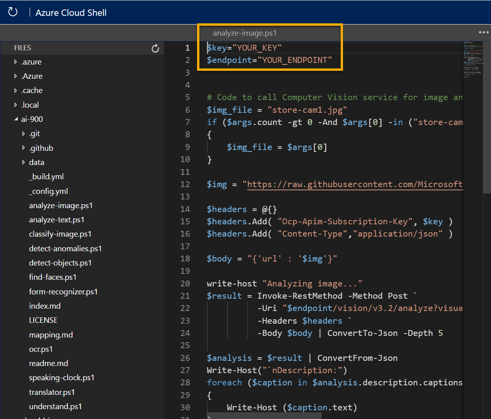

---
lab:
  title: 探索计算机视觉
---

# <a name="explore-computer-vision"></a>探索计算机视觉

> 注意：要完成此实验室，需要一个你在其中具有管理权限的 [Azure 订阅](https://azure.microsoft.com/free?azure-portal=true)。

计算机视觉认知服务使用预先训练的机器学习模型来分析图像并提取有关这些图像的信息。

例如，假设虚构零售商 Northwind Traders 已决定实现“智能商店”，其中 AI 服务监视商店以识别需要帮助的客户，并指示员工帮助他们。 通过使用计算机视觉服务，可以分析整个商店中的摄像头拍摄的照片，以提供其所描绘内容的有意义的说明。

在此实验室中，你将使用简单的命令行应用程序来查看计算机视觉服务的运行情况。 这些原则和功能同样适用于实际的解决方案，如网站或手机应用。

## <a name="create-a-cognitive-services-resource"></a>创建认知服务资源

可以通过创建“计算机视觉”资源或“认知服务”资源来使用计算机视觉服务。

如果尚未这样做，可在 Azure 订阅中创建“认知服务”资源。

1. 在另一个浏览器选项卡中，打开 Azure 门户 ([https://portal.azure.com](https://portal.azure.com?azure-portal=true))，并登录 Microsoft 帐户。

1. 单击“&#65291;创建资源”按钮，搜索“认知服务”，然后通过以下设置创建“认知服务”资源：
    - **订阅**：Azure 订阅。
    - **资源组**：选择或创建具有唯一名称的资源组。
    - **区域**：选择任何可用区域。
    - **名称**：输入唯一名称。
    - 定价层：标准版 S0
    - **选中此框即表示我确认我已阅读并理解以下所有条款**：已选中。

1. 查看并创建资源，然后等待部署完成。 然后，转到部署的资源。

1. 查看认知服务资源的“密钥和终结点”页。 需要终结点和密钥才能从客户端应用程序进行连接。

## <a name="run-cloud-shell"></a>运行 Cloud Shell

为了测试计算机视觉服务的功能，我们将使用在 Azure 上的 Cloud Shell 中运行的简单命令行应用程序。

1. 在 Azure 门户中，选择搜索框右侧页面顶部的 [>_] (Cloud Shell) 按钮。 这会打开门户底部的 Cloud Shell 窗格。

    

1. 首次打开 Cloud Shell 时，系统可能会提示你选择要使用的 shell 类型（Bash 或 PowerShell）。 从列表中选择“PowerShell”。 如果看不到此选项，请跳过该步骤。  

1. 如果系统提示你为 Cloud Shell 创建存储，请确保已指定订阅，然后选择“创建存储”。 等待存储创建完毕，此过程大约需要一分钟。

    

1. 请确保 Cloud Shell 窗格左上角指示的 shell 类型切换到 PowerShell。 如果是 Bash，请通过使用下拉菜单切换到 PowerShell。

    

1. 等待 PowerShell 启动。 你应在 Azure 门户中看到以下屏幕：  

    

## <a name="configure-and-run-a-client-application"></a>配置并运行客户端应用程序

现在，你已经有了 Cloud Shell 环境，可以运行简单应用程序，使用计算机视觉服务来分析图像。

1. 在命令行界面中，输入以下命令以下载示例应用程序并将其保存到名为“ai-900”的文件夹中。

    ```PowerShell
    git clone https://github.com/MicrosoftLearning/AI-900-AIFundamentals ai-900
    ```

    > 提示：如果已在其他实验室中使用此命令克隆 ai-900 存储库，则可跳过此步骤。

1. 文件将下载到名为“ai-900”的文件夹中。 现在，我们想要查看 Cloud Shell 存储中的所有文件，并使用这些文件。 在 shell 中键入以下命令：

    ```PowerShell
    code .
    ```

    请注意此操作如何打开一个编辑器，如下图所示：

    

1. 在左侧的“文件”窗格中，展开“ai-900”并选择“analyze-image.ps1”。 此文件包含使用计算机视觉服务分析图像的一些代码，如下所示：

    

1. 不要太担心代码，重要的是它需要终结点 URL 和认知服务资源的任何一个密钥。 从 Azure 门户中的资源的“密钥和终结点”页复制这些信息，并将它们粘贴到代码编辑器，分别替换 YOUR_KEY 和 YOUR_ENDPOINT 占位符值。

    > 提示：使用“密钥和终结点”和“编辑器”窗格时，可能需要使用分隔条来调整屏幕区域  。

    粘贴密钥和终结点值后，代码的前两行应如下所示：

    ```PowerShell
    $key="1a2b3c4d5e6f7g8h9i0j...."    
    $endpoint="https..."
    ```

1. 在编辑器窗格的右上方，使用“…”按钮打开菜单，然后选择“保存”以保存更改。

    示例客户端应用程序将使用计算机视觉服务来分析下面由 Northwind Traders 商店中的相机拍摄的图像：

    

1. 在 PowerShell 窗格中，输入以下命令以运行代码：

    ```PowerShell
    cd ai-900
    ./analyze-image.ps1 store-camera-1.jpg
    ```

1. 查看图像分析的结果，其中包括：
    - 描述图像的建议的标题。
    - 图像中识别出的对象的列表。
    - 与图像相关的“标记”的列表。

1. 现在，让我们尝试另一个图像：

    

    若要分析第二个图像，请输入以下命令：

    ```PowerShell
    ./analyze-image.ps1 store-camera-2.jpg
    ```

1. 查看第二个图像的图像分析结果。

1. 让我们再尝试一次：

    

    若要分析第三个图像，请输入以下命令：

    ```PowerShell
    ./analyze-image.ps1 store-camera-3.jpg
    ```

1. 查看第三个图像的图像分析结果。

## <a name="learn-more"></a>了解更多

这个简单的应用仅显示计算机视觉服务的部分功能。 要详细了解此服务的更多用途，请参阅[“计算机视觉”页](https://azure.microsoft.com/services/cognitive-services/computer-vision/)。
