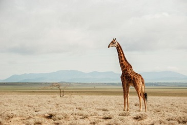

---
lab:
  title: 探索图像分类
---

# 探索图像分类

Azure AI 视觉服务提供用于处理图像的预生成模型，但你通常需要训练自己的计算机视觉模型。 例如，假设一个野生动物保护组织希望使用运动敏感相机跟踪动物的踪迹。 然后，相机拍摄的图像可用于验证特定地区是否存在特定物种，并协助濒危物种的保护工作。 为此，组织将利用图像分类模型，该模型经过训练以识别捕获的照片中的不同动物物种。

在 Azure 中，可以使用自定义视觉服务来基于现有图像训练图像分类模型。 创建图像分类解决方案有两个元素。 首先，必须使用现有图像训练模型来识别不同的类。 然后，在训练模型后，必须将其发布为可由应用程序使用的服务。

为了测试自定义视觉服务的功能，我们将使用在 Cloud Shell 中运行的简单命令行应用程序。 这些原则和功能同样适用于实际的解决方案，如网站或移动应用。

## 开始之前

若要完成此实验室，需要一个你在其中具有管理权限的 [Azure 订阅](https://azure.microsoft.com/free?azure-portal=true)。

## 创建 Azure AI 服务资源

可通过创建“自定义视觉”资源或“Azure AI 服务”资源来使用自定义视觉服务。

>注意：并非所有资源在每个区域中均可用。 无论是创建自定义视觉资源还是 Azure AI 服务资源，只有在[某些区域](https://azure.microsoft.com/global-infrastructure/services/?products=cognitive-services)创建的资源才能用于访问自定义视觉服务。 为简单起见，在以下配置说明中已为你预先选择了一个区域。

在 Azure 订阅中创建“Azure AI 服务”资源。

1. 打开 Azure 门户 ([https://portal.azure.com](https://portal.azure.com?azure-portal=true))，并登录 Microsoft 帐户。

1. 单击“&#65291;创建资源”按钮，然后搜索“Azure AI 服务”。 选择创建 Azure AI 服务计划。 随后你会转到一个页面，可在其中创建 Azure AI 服务资源。 使用以下设置对其进行配置：
    - **订阅**：Azure 订阅。
    - **资源组**：选择或创建具有唯一名称的资源组。
    - **区域**：美国东部
    - **名称**：输入唯一名称。
    - 定价层：标准版 S0
    - **选中此框即表示我确认我已阅读并理解以下所有条款**：已选中。

1. 查看并创建资源，然后等待部署完成。 然后，转到部署的资源。

1. 查看 Azure AI 服务资源的“密钥和终结点”页。 需要终结点和密钥才能从客户端应用程序进行连接。

## 创建自定义视觉项目

若要训练对象检测模型，需要基于训练资源创建自定义视觉项目。 为此，你将使用自定义视觉门户。

1. 从 [https://aka.ms/animal-images](https://aka.ms/animal-images) 下载并提取训练图像。 压缩文件夹中提供了这些图像，提取时，其中包含名为“大象”、“长颈鹿”和“狮子”的子文件夹。

1. 打开新的浏览器选项卡，浏览到自定义视觉门户 ([https://customvision.ai](https://customvision.ai?azure-portal=true))。 如果出现提示，请使用与你的 Azure 订阅关联的 Microsoft 帐户进行登录，并同意服务条款。

1. 在自定义视觉门户中，创建一个具有以下设置的新项目：

    - 名称：动物识别
    - 说明：动物的图像分类
    - 资源：先前创建的“Azure AI 服务”资源或“自定义视觉”资源
    - **项目类型**：分类
    - 分类类型：多类（每个图像一个标记）
    - 域：常规 \[A2]

1. 单击“添加图像”，并选择你之前提取的“大象”文件夹中的所有文件 。 然后上传图像文件，指定标记“大象”，如下所示：

    

1. 使用“添加图像”([+]) 按钮上传带有标记“长颈鹿”的“长颈鹿”文件夹中的图像，以及带有标记“狮子”的“狮子”文件夹中的图像。 

1. 浏览已在自定义视觉项目中上传的图像 - 每个类应有 17 个图像，如下所示：

    

1. 在自定义视觉项目的图像上方，单击“训练”以使用已标记的图像训练分类模型。 选择“快速训练”选项，然后等待训练迭代完成。

    > 提示：训练可能需要几分钟的时间。 在等待时，请查看[雪豹自拍和 AI 如何帮助拯救物种免受灭绝](https://news.microsoft.com/transform/snow-leopard-selfies-ai-save-species/)，它描述了一个使用计算机视觉跟踪野生濒危动物的真实项目。

1. 模型迭代已训练后，请查看“精度”、“召回率”和“AP”性能指标 - 这些指标度量分类模型的预测准确性，并且应该都很高。

## 测试模型

在发布此模型迭代供应用程序使用之前，应对其进行测试。

1. 在性能指标上方，单击“快速测试”。

1. 在“图像 URL”框中，键入 `https://aka.ms/giraffe` 并单击“快速测试图像 (&#10132;)”按钮。 

1. 查看模型返回的预测 -“长颈鹿”的概率分数应为最高，如下所示：

    

1. 关闭“快速测试”窗口。

## 发布图像分类模型

现在，你已准备好发布已训练模型并从客户端应用程序使用它。

1. 单击“&#128504; 发布”以通过以下设置发布已训练模型：
    - 模型名称：动物
    - 预测资源：先前创建的“Azure AI 服务”预测资源或“自定义视觉”预测资源。

1. 发布后，单击“预测 URL”(&#127760;) 图标，查看使用已发布模型所需的信息。

    

稍后，你将需要相应的 URL 和 Prediction-Key 值从图像 URL 中获取预测，因此请保持此对话框处于打开状态，然后继续执行下一个任务。

## 准备客户端应用程序

为了测试自定义视觉服务的功能，我们将使用在 Azure 上的 Cloud Shell 中运行的简单命令行应用程序。

1. 切换回包含 Azure 门户的浏览器选项卡，然后选择搜索框右侧页面顶部的 Cloud shell ([>_]) 按钮 。 随即将在门户底部打开 Cloud Shell 窗格。

    首次打开 Cloud Shell 时，系统可能会提示你选择要使用的 shell 类型（Bash 或 PowerShell）。 如果是这样，选择“PowerShell”。

    如果系统提示你为 Cloud Shell 创建存储，请确保已选中订阅，然后选择“创建存储”。 等待存储创建完毕，此过程大约需要一分钟。

    Cloud Shell 准备就绪后，它应如下所示：
    
    

    > 提示：确保 Cloud Shell 窗格左上角指示的 shell 类型为 PowerShell。 如果是 Bash，请通过使用下拉菜单切换到 PowerShell。

    请注意，可以通过拖动窗格顶部的分隔条或使用窗格右上角的 &#8212;、&#9723; 或 X 图标来调整 Cloud Shell 的大小，以最小化、最大化和关闭窗格  。 有关如何使用 Azure Cloud Shell 的详细信息，请参阅 [Azure Cloud Shell 文档](https://docs.microsoft.com/azure/cloud-shell/overview)。

2. 在命令行界面中，输入以下命令下载本练习的文件，并将其保存在名为“ai-900”的文件夹中（如果该文件夹已存在，需要先删除该文件夹）

    ```PowerShell
    rm -r ai-900 -f
    git clone https://github.com/MicrosoftLearning/AI-900-AIFundamentals ai-900
    ```

3. 下载文件后，输入以下命令以更改为 ai-900 目录，并编辑本练习的代码文件：

    ```PowerShell
    cd ai-900
    code classify-image.ps1
    ```

    注意此操作将打开一个编辑器，如下图所示：

     

     > 提示：可以使用 Cloud Shell 命令行和代码编辑器之间的分隔条来调整窗格的大小。

4. 不要太担心代码的详细信息。 重要的是，它从一些代码开始，以指定自定义视觉模型的预测 URL 和密钥。 需要更新这些项，使代码的其余部分使用你的模型。

    从自定义视觉项目的浏览器选项卡中保持打开状态的对话框中获取预测 URL 和预测密钥 。 如果有图像 URL，则需要使用版本。

    使用这些值替换代码文件中的 YOUR_PREDICTION_URL 和 YOUR_PREDICTION_KEY 占位符 。

    粘贴“预测 URL”和“预测密钥”值后，前两行代码应如下所示：

    ```PowerShell
    $predictionUrl="https..."
    $predictionKey ="1a2b3c4d5e6f7g8h9i0j...."
    ```

5. 对代码中的变量进行更改后，按 Ctrl+S 可保存文件。 然后，按 Ctrl+Q 可关闭代码编辑器。

## 测试客户端应用程序

现在，可以使用示例客户端应用程序根据图像包含的动物对图像进行分类。

1. 在 PowerShell 窗格中，输入以下命令以运行代码：

    ```PowerShell
    ./classify-image.ps1 1
    ```

    此代码使用模型对下图进行分类：

    

1. 查看预测，该预测应为“长颈鹿”。

1. 现在，让我们尝试另一张图像。 运行以下命令：

    ```PowerShell
    ./classify-image.ps1 2
    ```

    这次对下图进行分类：

    

1. 验证模型是否将此图像分类为“大象”。

1. 让我们再尝试一次。 运行以下命令：

    ```PowerShell
    ./classify-image.ps1 3
    ```

    最终图像如下所示：

    

1. 验证模型是否将此图像分类为“狮子”。

希望你的图像分类模型能够正确分类所有三个图像。


