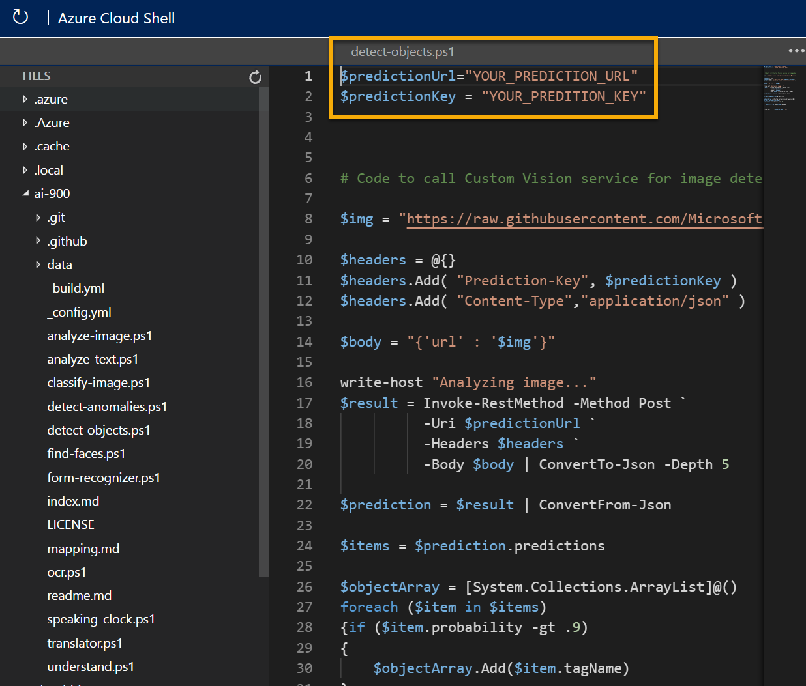

---
lab:
  title: 探索对象检测
---

# <a name="explore-object-detection"></a>探索对象检测

> 注意：要完成此实验室，需要一个你在其中具有管理权限的 [Azure 订阅](https://azure.microsoft.com/free?azure-portal=true)。

对象检测是计算机视觉的一种形式，在其中训练机器学习模型以对图像中的各个对象实例进行分类并指示标记其位置的边界框。 可以将其视为从图像分类（模型回答“这属于哪种图像？”这一问题）到生成解决方案（我们可以询问模型“此图像中有哪些对象，以及它们在何处？”）的过程。

例如，一家杂货店可能会使用对象检测模型来实现自动结帐系统，该系统使用摄像头扫描传送带，并且可以识别特定项，而无需将每个项放在传送带上并单独扫描。

Microsoft Azure 中的“自定义视觉”认知服务提供基于云的解决方案，用于创建和发布自定义对象检测模型。 在 Azure 中，可以使用自定义视觉服务来基于现有图像训练图像分类模型。 创建图像分类解决方案有两个元素。 首先，必须使用现有图像训练模型来识别不同的类。 然后，在训练模型后，必须将其发布为可由应用程序使用的服务。

为了测试自定义视觉服务的功能以检测图像中的对象，我们将使用在 Cloud Shell 中运行的简单命令行应用程序。 相同的原则和功能适用于实际解决方案，如网站或手机应用。

## <a name="create-a-cognitive-services-resource"></a>创建“认知服务”资源

可通过创建“自定义视觉”资源或“认知服务”资源来使用自定义视觉服务。

> 注意：并非所有资源在每个区域中均可用。 无论是创建自定义视觉资源还是创建认知服务资源，只有在[某些区域](https://azure.microsoft.com/global-infrastructure/services/?products=cognitive-services)创建的资源才能用于访问自定义视觉服务。 为简单起见，在以下配置说明中已为你预先选择了一个区域。

在 Azure 订阅中创建“认知服务”资源。

1. 在另一个浏览器选项卡中，打开 Azure 门户 ([https://portal.azure.com](https://portal.azure.com?azure-portal=true))，并登录 Microsoft 帐户。

1. 单击“&#65291;创建资源”按钮，搜索“认知服务”，然后通过以下设置创建“认知服务”资源：
    - **订阅**：Azure 订阅。
    - **资源组**：选择或创建具有唯一名称的资源组。
    - **区域**：美国东部
    - **名称**：输入唯一名称。
    - 定价层：标准版 S0
    - **选中此框即表示我确认我已阅读并理解以下所有条款**：已选中。

1. 查看并创建资源，然后等待部署完成。 然后，转到部署的资源。

1. 查看认知服务资源的“密钥和终结点”页。 需要终结点和密钥才能从客户端应用程序进行连接。

## <a name="create-a-custom-vision-project"></a>创建自定义视觉项目

若要训练对象检测模型，需要基于训练资源创建自定义视觉项目。 为此，你将使用自定义视觉门户。

1. 在新的浏览器选项卡中，打开自定义视觉门户 ([https://customvision.ai](https://customvision.ai?azure-portal=true))，然后使用与 Azure 订阅关联的 Microsoft 帐户登录。

1. 创建一个具有以下设置的新项目：
    - 名称：杂货检测
    - 说明：针对杂货进行的对象检测。
    - 资源：先前创建的资源
    - 项目类型：对象检测
    - **域**：常规

1. 等待项目创建并在浏览器中打开。

## <a name="add-and-tag-images"></a>添加图像并进行标记

若要训练对象检测模型，需要上传包含希望模型识别的类的图像，并标记这些图像以指示每个对象实例的边界框。

1. 从 https://aka.ms/fruit-objects 下载并提取训练图像。 提取的文件夹包含水果图像的集合。

1. 在自定义视觉门户 [https://customvision.ai](https://customvision.ai?azure-portal=true) 中，确保你正在处理对象检测项目“杂货检测”。 然后选择“添加图像”并上传已提取文件夹中的所有图像。

    

1. 上传图像后，选择第一个图像将其打开。

1. 将鼠标悬停在图像中的任意对象上，直到自动检测到的区域如下图所示。 然后选择对象，并根据需要调整区域大小以将其环绕。

    

    或者，只需在对象周围拖动以创建区域。

1. 当区域环绕对象时，使用相应的对象类型（“苹果”、“香蕉”或“橘子”）添加新标记，如下所示：

    

1. 选择并标记图像中的各个对象，从而根据需要调整区域大小并添加新标记。

    

1. 使用右侧的 > 链接转到下一个图像，并标记其对象。 然后，继续处理整个图像集合，标记每个苹果、香蕉和橘子。

1. 标记完最后一个图像后，关闭“图像详细信息”编辑器，在“训练图像”页上的“标记”下，选择“已标记”以查看所有已标记的图像：

    

## <a name="train-and-test-a-model"></a>训练和测试模型

现在你已标记项目中的图像，即可训练模型。

1. 在自定义视觉项目中，单击“训练”以使用已标记的图像训练对象检测模型。 选择“快速训练”选项。

1. 等待训练完成（可能需要大约 10 分钟），然后查看“精准率”、“召回率”和“mAP”性能指标 - 这些指标衡量对象检测模型的预测准确性，并且应该都很高。

1. 在页面的右上角，单击“快速测试”，然后在“图像 URL”框中输入 `https://aka.ms/apple-orange` 并查看已生成的预测。 然后关闭“快速测试”窗口。

## <a name="publish-the-object-detection-model"></a>发布对象检测模型

现在，你已准备好发布已训练模型并从客户端应用程序使用它。

1. 单击“&#128504; 发布”以通过以下设置发布已训练模型：
    - 模型名称：detect-produce
    - 预测资源：先前创建的资源。

1. 发布后，单击“预测 URL”(&#127760;) 图标，查看使用已发布模型所需的信息。 稍后，你将需要相应的 URL 和 Prediction-Key 值从图像 URL 中获取预测，因此请保持此对话框处于打开状态，然后继续执行下一个任务。

## <a name="run-cloud-shell"></a>运行 Cloud Shell

为了测试自定义视觉服务的功能，我们将使用在 Azure 上的 Cloud Shell 中运行的简单命令行应用程序。

1. 在 Azure 门户中，选择搜索框右侧页面顶部的 [>_] (Cloud Shell) 按钮。 这会打开门户底部的 Cloud Shell 窗格。 

    

1. 首次打开 Cloud Shell 时，系统可能会提示你选择要使用的 shell 类型（Bash 或 PowerShell）。 从列表中选择“PowerShell”。 如果看不到此选项，请跳过该步骤。  

1. 如果系统提示你为 Cloud Shell 创建存储，请确保已指定订阅，然后选择“创建存储”。 等待存储创建完毕，此过程大约需要一分钟。

    

1. 确保 Cloud Shell 窗格左上角指示的 shell 类型已切换到 PowerShell。 如果是 Bash，请通过使用下拉菜单切换到 PowerShell。

     

1. 等待 PowerShell 启动。 你应在 Azure 门户中看到以下屏幕：  

     

## <a name="configure-and-run-a-client-application"></a>配置和运行客户端应用程序

现在，你已有一个自定义模型，可以运行使用自定义视觉服务的简单客户端应用程序来检测图像中的对象。

1. 在命令行界面中，输入以下命令以下载示例应用程序并将其保存到名为 ai-900 的文件夹中。

    ```PowerShell
    git clone https://github.com/MicrosoftLearning/AI-900-AIFundamentals ai-900
    ```

    >注意：如果已在其他实验室中使用此命令克隆 ai-900 存储库，则可跳此该步骤。

1. 文件将下载到名为“ai-900”的文件夹中。 现在，我们想要查看 Cloud Shell 存储中的所有文件，并使用这些文件。 在 shell 中键入以下命令：

    ```PowerShell
    code .
    ```

    请注意此操作如何打开一个编辑器，如下图所示： 

    

1. 在左侧的“文件”窗格中，展开“ai-900”并选择“detect-objects.ps1”。 此文件包含一些代码，这些代码使用自定义视觉服务检测图像中的对象，如下所示：

    

1. 不要太担心代码的细节，重要的是在使用图像 URL 时需要预测 URL 和自定义视觉模型的密钥。 

    从自定义视觉项目的对话框中获取预测 URL。 

    >注意：请记住，在发布图像分类模型后，你查看了预测 URL。 若要查找预测 URL，请导航至项目中的“性能”选项卡，然后单击“预测 URL”（如果屏幕已压缩，则可能只会看到一个地球图标）。 此时将显示一个对话框。 复制“如果有图像 URL”的 URL。 将其粘贴到代码编辑器中，从而替换 YOUR_PREDICTION_URL。 

    使用同一个对话框，获取预测密钥。 复制 Set Prediction-Key Header to 之后显示的预测密钥。 将其粘贴到代码编辑器中，从而替换 YOUR_PREDICTION_KEY 占位符值。 

    

    粘贴“预测 URL”和“预测密钥”值后，前两行代码应如下所示：

    ```PowerShell
    $predictionUrl="https..."
    $predictionKey ="1a2b3c4d5e6f7g8h9i0j...."
    ```

1. 在编辑器窗格的右上方，使用“...”按钮打开菜单，然后选择“保存”以保存更改。 然后再次打开菜单，并选择“关闭编辑器”。

    你将使用示例客户端应用程序来检测此图像中的对象：

    

1. 在 PowerShell 窗格中，输入以下命令以运行代码：

    ```PowerShell
    cd ai-900
    ./detect-objects.ps1 
    ```

1. 查看预测，该预测应为苹果、橘子、香蕉。

## <a name="learn-more"></a>了解更多

这个简单的应用仅显示自定义视觉服务的部分功能。 若要详细了解此服务的更多用途，请参阅[“自定义视觉”页](https://azure.microsoft.com/services/cognitive-services/custom-vision-service/)。
