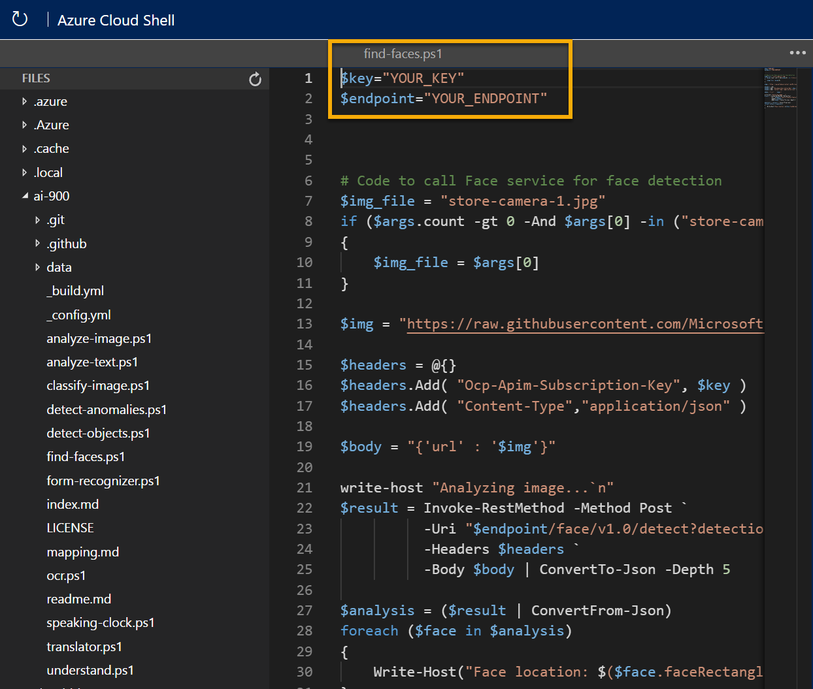
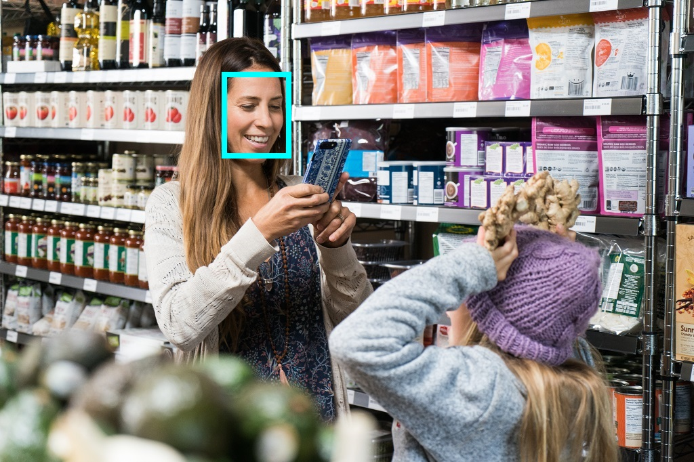

---
lab:
  title: 探索人脸识别
---

# 探索人脸识别

> 注意：要完成此实验室，需要一个你在其中具有管理权限的 [Azure 订阅](https://azure.microsoft.com/free?azure-portal=true)。

计算机视觉解决方案通常需要人工智能 (AI) 解决方案才能检测人脸。 例如，假设零售公司 Northwind Traders 想要定位顾客在商店中的位置，以为其提供最佳帮助。 完成此任务的一种方法是确定图像中是否有人脸，如果有，则确定人脸周围的边框坐标。

为了测试人脸服务的功能，我们将使用在 Cloud Shell 中运行的简单命令行应用程序。 相同的原则和功能适用于实际解决方案，如网站或手机应用。

## 创建“人脸 API”资源

可以通过创建人脸资源使用人脸服务。 （人脸 API 在认知服务中不再可用）

如果尚未这样做，可在 Azure 订阅中创建“人脸 API”资源。

1. 在另一个浏览器选项卡中，打开 Azure 门户 ([https://portal.azure.com](https://portal.azure.com?azure-portal=true))，并登录 Microsoft 帐户。

1. 单击“&#65291;创建资源”按钮，搜索“人脸”，然后使用以下设置创建“人脸”资源：
    - **订阅**：Azure 订阅。
    - **资源组**：选择或创建具有唯一名称的资源组。
    - **区域**：选择任何可用区域。
    - **名称**：输入唯一名称。
    - **定价层**：免费 F0

1. 查看并创建资源，然后等待部署完成。 然后，转到部署的资源。

1. 查看“人脸”资源的“密钥和终结点”页。 需要终结点和密钥才能从客户端应用程序进行连接。

## 运行 Cloud Shell

为了测试人脸服务的功能，我们将使用在 Azure 上的 Cloud Shell 中运行的简单命令行应用程序。 

1. 在 Azure 门户中，选择搜索框右侧页面顶部的 [>_] (Cloud Shell) 按钮。 这会打开门户底部的 Cloud Shell 窗格。 

    

1. 首次打开 Cloud Shell 时，系统可能会提示你选择要使用的 shell 类型（Bash 或 PowerShell）。 从列表中选择“PowerShell”。 如果看不到此选项，请跳过该步骤。  

1. 如果系统提示你为 Cloud Shell 创建存储，请确保已指定订阅，然后选择“创建存储”。 等待存储创建完毕，此过程大约需要一分钟。

           

1. 确保 Cloud Shell 窗格左上角指示的 shell 类型已切换到 PowerShell。 如果是 Bash，请通过使用下拉菜单切换到 PowerShell。

     

1. 等待 PowerShell 启动。 你应在 Azure 门户中看到以下屏幕：  

    

## 配置和运行客户端应用程序

现在，你已有一个自定义模型，可以运行使用人脸服务的简单客户端应用程序。

1. 在命令行界面中，输入以下命令以下载示例应用程序并将其保存到名为 ai-900 的文件夹中。

    ```PowerShell
    git clone https://github.com/MicrosoftLearning/AI-900-AIFundamentals ai-900
    ```

    > 提示：如果已在其他实验室中使用此命令克隆 ai-900 存储库，则可跳过此步骤。

1. 文件将下载到名为“ai-900”的文件夹中。 现在，我们想要查看 Cloud Shell 存储中的所有文件，并使用这些文件。 在 shell 中键入以下命令：

     ```PowerShell
    code .
    ```

    请注意此操作如何打开一个编辑器，如下图所示： 

     

1. 在左侧的“文件”窗格中，展开“ai-900”并选择“find-faces.ps1”。 此文件包含使用人脸服务检测和分析图像中的人脸的一些代码，如下所示：

    

1. 不要太担心代码的细节，重要的是它需要终结点 URL 和人脸资源的任何一个密钥。 从 Azure 门户中的资源的“密钥和终结点”页复制这些信息，并将它们粘贴到代码编辑器，分别替换 YOUR_KEY 和 YOUR_ENDPOINT 占位符值。

    > 提示：使用“密钥和终结点”和“编辑器”窗格时，可能需要使用分隔条来调整屏幕区域  。

    粘贴密钥和终结点值后，代码的前两行应如下所示：

    ```PowerShell
    $key="1a2b3c4d5e6f7g8h9i0j...."    
    $endpoint="https..."
    ```

1. 在编辑器窗格的右上方，使用“...”按钮打开菜单，然后选择“保存”以保存更改。 然后再次打开菜单，并选择“关闭编辑器”。

    示例客户端应用程序将使用人脸服务来分析下面由 Northwind Traders 商店中的相机拍摄的图像：

    

1. 在 PowerShell 窗格中，输入以下命令以运行代码：

    ```PowerShell
    cd ai-900
    ./find-faces.ps1 store-camera-1.jpg
    ```

1. 查看返回的信息，其中包括人脸在图像中的位置。 人脸的位置由左上坐标以及边框的宽度和高度指示，如下所示：

    

    >注意：返回个人身份特征的人脸服务功能受到限制。 有关详细信息，请参阅https://azure.microsoft.com/blog/responsible-ai-investments-and-safeguards-for-facial-recognition/。

1. 现在，让我们尝试另一张图像：

    

    若要分析第二张图像，请输入以下命令：

    ```PowerShell
    ./find-faces.ps1 store-camera-2.jpg
    ```

1. 查看第二张图像的人脸分析结果。

1. 让我们再尝试一次：

    

    若要分析第三张图像，请输入以下命令：

    ```PowerShell
    ./find-faces.ps1 store-camera-3.jpg
    ```

1. 查看第三个图像的人脸分析结果。

## 了解更多

这个简单的应用只显示了人脸服务的某些功能。 要详细了解此服务的更多用途，请参阅[“人脸 API”页](https://azure.microsoft.com/en-us/products/cognitive-services/vision-services)。
