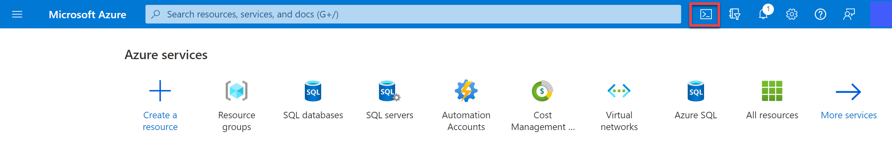

---
lab:
  title: 探索光学字符识别
---

# 探索光学字符识别

> 注意：要完成此实验室，需要一个你在其中具有管理权限的 [Azure 订阅](https://azure.microsoft.com/free?azure-portal=true)。

常见的计算机视觉挑战是检测和解释图像中的文本。 这种处理通常称为光学字符识别 (OCR)。 Microsoft 的读取 API 提供对 OCR 功能的访问权限。 

为了测试读取 API 的功能，我们将使用在 Cloud Shell 中运行的简单命令行应用程序。 相同的原则和功能适用于实际解决方案，如网站或手机应用。

## 使用 Azure AI 视觉服务读取图像中的文本

Azure AI 视觉**** 服务提供对 OCR 任务的支持，包括：

- 针对较大文档进行优化的一种读取 API。 此 API 以异步方式使用，可用于印刷文本和手写文本。

## 创建 Azure AI 服务资源

可以通过创建计算机视觉**** 资源或 Azure AI 服务**** 资源来使用 Azure AI 视觉服务。

在 Azure 订阅中创建一个 Azure AI 服务资源（如果尚未这样做）。

1. 在另一个浏览器选项卡中，打开 Azure 门户 ([https://portal.azure.com](https://portal.azure.com?azure-portal=true))，并登录 Microsoft 帐户。

1. 单击“&#65291;创建资源”按钮，然后搜索“Azure AI 服务”。 选择创建 Azure AI 服务计划。 随后你会转到一个页面，可在其中创建 Azure AI 服务资源。 使用以下设置对其进行配置：
    - **订阅**：Azure 订阅。
    - **资源组**：选择或创建具有唯一名称的资源组。
    - **区域**：选择任何可用区域。
    - **名称**：输入唯一名称。
    - 定价层：标准版 S0
    - **选中此框即表示我确认我已阅读并理解以下所有条款**：已选中。

1. 查看并创建资源，然后等待部署完成。 然后，转到部署的资源。

1. 查看 Azure AI 服务资源的“密钥和终结点”页。 需要终结点和密钥才能从客户端应用程序进行连接。

## 运行 Cloud Shell

为了测试自定义视觉服务的功能，我们将使用在 Azure 上的 Cloud Shell 中运行的简单命令行应用程序。

1. 在 Azure 门户中，选择搜索框右侧页面顶部的 [>_] (Cloud Shell) 按钮。 这会打开门户底部的 Cloud Shell 窗格。 

    

1. 首次打开 Cloud Shell 时，系统可能会提示你选择要使用的 shell 类型（Bash 或 PowerShell）。 从列表中选择“PowerShell”。 如果看不到此选项，请跳过该步骤。  

1. 如果系统提示你为 Cloud Shell 创建存储，请确保已指定订阅，然后选择“创建存储”。 等待存储创建完毕，此过程大约需要一分钟。

    

1. 请确保 Cloud Shell 窗格左上角指示的 shell 类型切换到 PowerShell。 如果是 Bash，请通过使用下拉菜单切换到 PowerShell。

     

1. 等待 PowerShell 启动。 你应在 Azure 门户中看到以下屏幕：  

     

## 配置和运行客户端应用程序

现在，你已有一个自定义模型，可以运行使用 OCR 服务的简单客户端应用程序。

1. 在命令行界面中，输入以下命令以下载示例应用程序并将其保存到名为 ai-900 的文件夹中。

    ```PowerShell
    git clone https://github.com/MicrosoftLearning/AI-900-AIFundamentals ai-900
    ```

    >提示：如果已在其他实验室中使用此命令克隆 ai-900 存储库，则可跳过此步骤。

1. 文件将下载到名为“ai-900”的文件夹中。 现在，我们想要查看 Cloud Shell 存储中的所有文件，并使用这些文件。 在 shell 中键入以下命令：

    ```PowerShell
    code .
    ```

    请注意此操作如何打开一个编辑器，如下图所示： 

    

1. 在左侧的“文件”窗格中，展开“ai-900”并选择“ocr.ps1”。 此文件包含使用计算机视觉服务检测和分析图像中的文本的一些代码，如下所示：

    

1. 不要太担心代码的细节，重要的是它需要终结点 URL 和 Azure AI 服务资源的任一密钥。 从 Azure 门户中的资源的“密钥和终结点”页复制这些信息，并将它们粘贴到代码编辑器，分别替换 YOUR_KEY 和 YOUR_ENDPOINT 占位符值。

    > 提示：使用“密钥和终结点”和“编辑器”窗格时，可能需要使用分隔条来调整屏幕区域  。

    粘贴密钥和终结点值后，代码的前两行应如下所示：

    ```PowerShell
    $key="1a2b3c4d5e6f7g8h9i0j...."    
    $endpoint="https..."
    ```

1. 在编辑器窗格的右上方，使用“...”按钮打开菜单，然后选择“保存”以保存更改。 然后再次打开菜单，并选择“关闭编辑器”。 设置密钥和终结点后，可以使用 Azure AI 服务资源从图像中提取文本。

    接下来使用读取 API。 在这种情况下，你有一个虚构的 Northwind Traders 零售公司广告图像，其中包含一些文本。

    示例客户端应用程序将分析下图：

    

1. 在 PowerShell 窗格中，输入以下命令运行代码以读取文本：

    ```PowerShell
    cd ai-900
    ./ocr.ps1 advert.jpg
    ```

1. 查看在图像中发现的详细信息。 图像中的文本组织成区域、行和单词的层次结构，代码读取这些内容以检索结果。

    请注意，文本的位置由左上坐标以及范围框的宽度和高度指示，如下所示：

    

1. 现在，让我们尝试另一张图像：

    

    若要分析第二张图像，请输入以下命令：

    ```PowerShell
    ./ocr.ps1 letter.jpg
    ```

1. 查看第二张图像的分析结果。 它还应返回文本的文本和边界框。

## 了解更多

这个简单的应用仅显示计算机视觉服务的部分 OCR 功能。 要详细了解此服务的更多用途，请参阅[“OCR”页](https://docs.microsoft.com/azure/cognitive-services/computer-vision/overview-ocr)。
