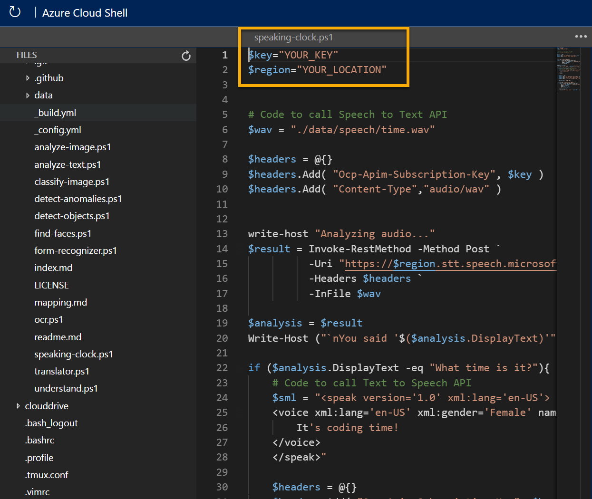

---
lab:
  title: 探索语音
---

# 探索语音

> 注意：要完成此实验室，需要一个你在其中具有管理权限的 [Azure 订阅](https://azure.microsoft.com/free?azure-portal=true)。

要生成可解释有声语音并做出适当响应的软件，可以使用 Azure AI 语音服务，它提供了将口语转录为文本（反之亦然）的简单方法。

例如，假设你想要创建可口头回答口述问题（例如“几点了？”）的智能设备 响应应为本地时间。

为了测试语音服务的功能，我们将使用在 Cloud Shell 中运行的简单命令行应用程序。 这些原则和功能同样适用于实际的解决方案，如网站或手机应用。

## 创建 Azure AI 服务资源

可通过创建“语音”资源或“Azure AI 服务”资源来使用语音服务。

在 Azure 订阅中创建一个 Azure AI 服务资源（如果尚未这样做）。

1. 在另一个浏览器选项卡中，打开 Azure 门户 ([https://portal.azure.com](https://portal.azure.com?azure-portal=true))，并登录 Microsoft 帐户。

1. 单击“&#65291;创建资源”按钮，然后搜索“Azure AI 服务”。 选择创建一个 Azure AI 服务计划。 随后你会转到一个页面，可在其中创建 Azure AI 服务资源。 使用以下设置对其进行配置：
    - **订阅**：Azure 订阅。
    - **资源组**：选择或创建具有唯一名称的资源组。
    - **区域**：选择任何可用区域。
    - **名称**：输入唯一名称。
    - 定价层：标准版 S0
    - **选中此框即表示我确认我已阅读并理解以下所有条款**：已选中。

1. 查看并创建资源。

### 获取 Azure AI 服务资源的密钥和位置

1. 等待部署完成。 然后转到 Azure AI 服务资源，在“概述”页上，单击链接以管理服务的密钥。 需要终结点和密钥，以从客户端应用程序连接到 Azure AI 服务资源。

1. 查看资源的“密钥和终结点”页。 需要位置/区域和密钥才能从客户端应用程序进行连接。

## 运行 Cloud Shell

为了测试语音服务的功能，我们将使用在 Azure 上的 Cloud Shell 中运行的简单命令行应用程序。

1. 在 Azure 门户中，选择搜索框右侧页面顶部的 [>_] (Cloud Shell) 按钮。 这会打开门户底部的 Cloud Shell 窗格。

    

1. 首次打开 Cloud Shell 时，系统可能会提示你选择要使用的 shell 类型（Bash 或 PowerShell）。 从列表中选择“PowerShell”。 如果看不到此选项，请跳过该步骤。  

1. 如果系统提示你为 Cloud Shell 创建存储，请确保已指定订阅，然后选择“创建存储”。 等待存储创建完毕，此过程大约需要一分钟。

    

1. 请确保 Cloud Shell 窗格左上角指示的 shell 类型切换到 PowerShell。 如果是 Bash，请通过使用下拉菜单切换到 PowerShell。

    

1. 等待 PowerShell 启动。 你应在 Azure 门户中看到以下屏幕：  

    

## 配置并运行客户端应用程序

现在，你已有一个自定义模型，可以运行使用语音服务的简单客户端应用程序。

1. 在命令行界面中，输入以下命令以下载示例应用程序并将其保存到名为“ai-900”的文件夹中。

    ```PowerShell
    git clone https://github.com/MicrosoftLearning/AI-900-AIFundamentals ai-900
    ```

    >提示：如果已在其他实验室中使用此命令克隆 ai-900 存储库，则可跳过此步骤。

1. 文件将下载到名为“ai-900”的文件夹中。 现在，我们想要查看 Cloud Shell 存储中的所有文件，并使用这些文件。 在 shell 中键入以下命令：

     ```PowerShell
    code .
    ```

    请注意此操作如何打开一个编辑器，如下图所示：

    

1. 在左侧的“文件”窗格中，展开“ai-900”并选择“speaking-clock.ps1”。 此文件包含使用语音服务识别和合成语音的一些代码：

    

1. 不要太担心代码的细节，重要的是它需要区域/位置和 Azure AI 服务资源的其中一个密钥。 从 Azure 门户中的资源的“密钥和终结点”页复制这些信息，并将它们粘贴到代码编辑器，分别替换 YOUR_KEY 和 YOUR_LOCATION 占位符值。

    > 提示：使用“密钥和终结点”和“编辑器”窗格时，可能需要使用分隔条来调整屏幕区域  。

    粘贴密钥和区域/位置值后，代码的第一行应如下所示：

    ```PowerShell
    $key = "1a2b3c4d5e6f7g8h9i0j...."
    $region="somelocation"
    ```

1. 在编辑器窗格的右上方，使用“…”按钮打开菜单，然后选择“保存”以保存更改。 然后再次打开菜单，并选择“关闭编辑器”。

    示例客户端应用程序将使用语音服务转录口述输入并合成相应的口述响应。 实际的应用程序将接受麦克风的输入并将响应发送给扬声器，但在这个简单的示例中，我们将在文件中使用预先录制的输入并将响应另存为其他文件。

    使用以下视频播放器收听应用程序将处理的输入音频：

    <div class="embeddedvideo"><iframe src="https://www.microsoft.com/videoplayer/embed/RWMAvi" frameborder="0" allowfullscreen="true" data-linktype="external"></iframe></div>

1. 在 PowerShell 窗格中，输入以下命令以运行代码：

    ```PowerShell
    cd ai-900
    ./speaking-clock.ps1
    ```

1. 查看输出，该输出应已成功识别文本“几点了？” 并将相应的响应保存在名为 output.wav 的文件中。

    使用以下视频播放器收听应用程序生成的口述输出：

    <div class="embeddedvideo"><iframe src="https://www.microsoft.com/videoplayer/embed/RWMSIU" frameborder="0" allowfullscreen="true" data-linktype="external"></iframe></div>

## 了解更多

这个简单的应用只显示了语音服务的某些功能。 若要详细了解此服务的更多用途，请参阅[“语音”页](https://azure.microsoft.com/services/cognitive-services/speech-services/)。
