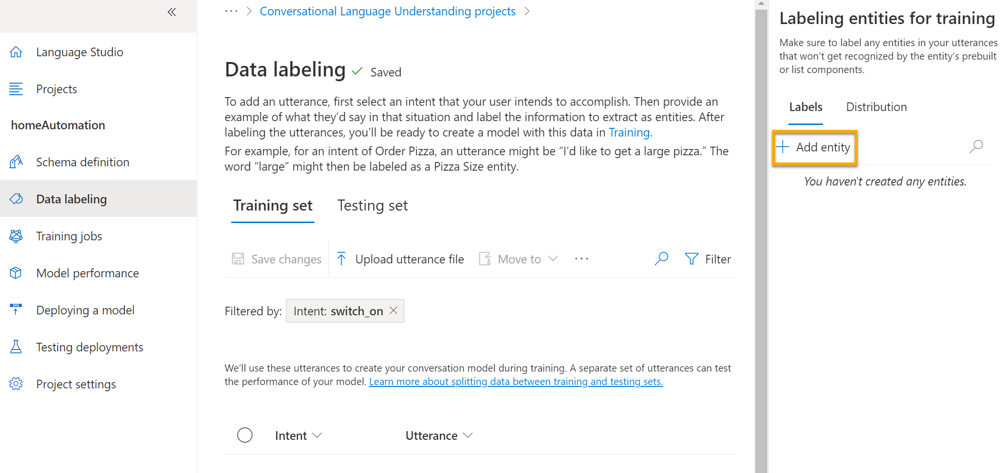
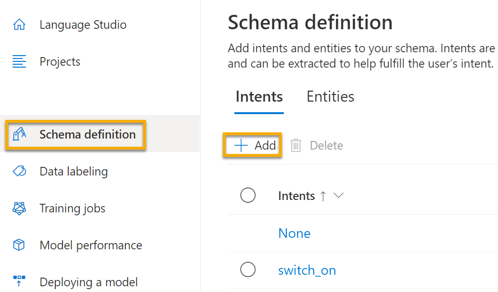
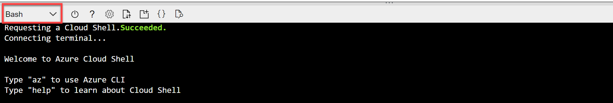

---
lab:
  title: 探索语言理解
---

# 探索语言理解

> 注意：要完成此实验室，需要一个你在其中具有管理权限的 [Azure 订阅](https://azure.microsoft.com/free?azure-portal=true)。

我们越来越希望计算机能够使用 AI 来理解自然语言中的口头命令或文字命令。 例如，你可能需要实现一个家居自动化系统，能够让你使用语音命令（如“开灯”或“打开风扇”）来控制家中的设备，还想拥有一台支持 AI 的设备来理解命令并采取相应的操作。

为了测试对话语言理解服务的功能，我们将使用在 Cloud Shell 中运行的命令行应用程序。 相同的原则和功能适用于实际解决方案，如网站或手机应用。

## 创建“语言服务”资源

你可以通过创建“语言服务”资源来使用对话语言理解服务。

如果尚未这样做，可在 Azure 订阅中创建“语言服务”资源。

1. 在另一个浏览器选项卡中，打开 Azure 门户 ([https://portal.azure.com](https://portal.azure.com?azure-portal=true))，并登录 Microsoft 帐户。

1. 单击“&#65291;创建资源”按钮，搜索“语言服务”，并使用以下设置创建“语言服务”资源：
    - 选择其他功能：保留默认功能，并单击“继续”创建资源  
    - **订阅**：Azure 订阅。
    - **资源组**：选择或创建具有唯一名称的资源组。
    - **地区**：美国东部 2
    - **名称**：输入唯一名称。
    - **定价层**：S（每分钟 1000 次调用）
    - **选中此框即表示我已查看并确认负责任 AI 声明中的条款**：已选中。

1. 查看并创建资源，然后等待部署完成。

### 创建对话语言理解应用程序

若要使用对话语言理解功能实现自然语言理解，请创建一个应用；然后添加实体、意图和言语来定义想要应用执行的命令。

1. 在新的浏览器标签页中，打开“Language Studio”门户 ([https://language.azure.com](https://language.azure.com?azure-portal=true))，然后使用与 Azure 订阅关联的 Microsoft 帐户登录。

1. 如果系统提示选择语言资源，请选择以下设置：
    - **Azure 目录**：包含订阅的 Azure 目录。
    - **订阅**：Azure 订阅。
    - **语言资源**：先前创建的语言资源。

    >提示：如果系统未提示你选择语言资源，原因可能是订阅中有多个语言资源；在这种情况下，你应该：
    >1. 在页面顶部的栏中，单击“设置(&#9881;)”按钮。
    >1. 在“设置”页上，查看“资源”选项卡。
    >1. 选择语言资源，然后单击“切换资源”。
    >1. 在页面顶部，单击“Language Studio”以返回到 Language Studio 主页。

1. 在门户顶部的“新建”菜单中，选择“对话语言理解”。

1. 在“创建项目”对话框中，在“输入基本信息”页上输入以下详细信息，然后单击“下一步”：
    - **名称**：创建唯一名称
    - **说明**：简单的家居自动化
    - 言语主要语言：英语
    - **在项目中启用多种语言**： *不选择*

    

    >提示：记下项目名称，稍后将使用它。

1. 在“检查并完成”页上，单击“创建”。

### 创建意图、言语和实体

意向是你想要执行的操作；例如，你可能需要开灯或关闭风扇。 在这种情况下，将定义两个意向：一个打开设备，另一个关闭设备。 对于每个意向，都要指定示例言语来表明用于指示意向的语言类型。

1. 在“架构定义”窗格中，确保选中“意图”。然后单击“添加”，添加名为“switch_on”（小写）的意图，最后单击“添加意图”。

    
    

1. 选择“switch_on”意图。 你将转到“数据标签”页。 在“意向”下拉列表中，选择“switch_on” 。 在“switch_on”意向旁边，键入语句“turn the light on”，然后按 Enter，将此语句提交到列表中。

    

1. 语言服务需要为每个意向提供至少五个不同的语句示例，以便充分训练语言模型。 将其他五个言语示例添加到“switch_on”意图：  
    - ***switch on the fan***
    - put the fan on
    - put the light on
    - switch on the light
    - turn the fan on

1. 在屏幕右侧的“标记用于训练的实体”窗格上选择“标签”，然后选择“添加实体”。 键入小写的“device”（设备），选择“列表”，然后选择“添加实体”。

     
    

1. 在“turn the fan on”语句中，突出显示“fan”一词。 然后在出现的列表中，在“搜索实体”框中选择“device”。

    

1. 对所有言语执行相同的操作。 使用设备实体标记其余“fan”（风扇）或“light”（灯）言语。 完成后，请验证是否具有以下言语，并且请务必选择“保存更改”：

    | 意向 | 语句 | 实体 |
    | --------------- | ------------------ | ------------------ |
    | switch_on   | Put on the fan      | 设备 - 选择风扇 |
    | switch_on   | Put on the light    | 设备 - 选择灯 |
    | switch_on   | Switch on the light | 设备 - 选择灯 |
    | switch_on   | Turn the fan on     | 设备 - 选择风扇 |
    | switch_on   | Switch on the fan   | 设备 - 选择风扇 |
    | switch_on   | Turn the light on   | 设备 - 选择灯 |

     

1. 在左侧窗格中，单击“架构定义”并验证是否列出了“switch_on”意图。 然后单击“添加”并添加一个名为“switch_off”（小写）的新意图。

     

1. 单击“switch_off”意图。 你将转到“数据标签”页。 在“意向”下拉列表中，选择“switch_off” 。 在“switch_off”意向旁边，添加语句“turn the light off”。

1. 将其他五个语句示例添加到“switch_off”意图。
    - ***switch off the fan***
    - put the fan off
    - put the light off
    - turn off the light
    - switch the fan off

1. 使用设备实体标记字词“light”（灯）或“fan”（风扇）。 完成后，请验证是否具有以下言语，并且请务必选择“保存更改”：  

    | 意向 | 语句 | 实体 | 
    | --------------- | ------------------ | ------------------ |
    | switch_off   | Put the fan off    | 设备 - 选择风扇 | 
    | switch_off   | Put the light off  | 设备 - 选择灯 |
    | switch_off   | Turn off the light | 设备 - 选择灯 |
    | switch_off   | Switch the fan off | 设备 - 选择风扇 |
    | switch_off   | Switch off the fan | 设备 - 选择风扇 |
    | switch_off   | Turn the light off | 设备 - 选择灯 |

### 定型模型

现在，可以使用定义的意图和实体来为应用程序训练对话语言模型。

1. 在 Language Studio 的左侧，选择“训练作业”，然后选择“开始训练作业”。 使用以下设置： 
    - **训练新模型**： 已选择并选择模型名称
    - **训练模式**：标准训练（免费）
    - **数据拆分**：选择“从训练数据中自动拆分测试集”，保留默认百分比
    - 单击页面底部的“训练”。

1. 等待训练完成。 

### 部署并测试模型

若要在客户端应用程序中使用训练的模型，必须将其部署为终结点，客户端应用程序将能够向其发送新言语，并且可通过该终结点预测意向和实体。

1. 在 Language Studio 的左侧，单击“部署模型”。

1. 选择模型名称，然后单击“添加部署”。 使用以下设置：
    - **创建或选择现有部署名称**：选择“创建新的部署名称”。添加唯一名称。
    - **将经过训练的模型分配到部署名称**：选择经过训练的模型名称。
    - 单击“部署”

    >提示：记下部署名称，稍后将使用它。 

1. 部署模型时，单击页面左侧的“测试部署”，然后在部署名称下选择自己的已部署模型。

1. 输入以下文本，然后选择“运行测试”：

    switch the light on

     

    查看返回的结果，注意它包含预测意向（哪些应该是 switch_on）和预测实体（设备），其置信度分数表示该模型所计算的预测意向和实体计算的概率。 “JSON”选项卡显示每个潜在意向的对比置信度（置信度分数最高的潜在意向就是预测意向）

1. 清除文本框，并在“输入自己的文本或上传文本文档”下使用以下语句测试模型：
    - *turn off the fan*
    - put the light on
    - *put the fan off*

## 运行 Cloud Shell

现在，让我们试试部署的模型。 为此，我们将使用一个命令行应用程序，该应用程序在 Azure 上的 Cloud Shell 中运行。 

1. 将浏览器选项卡保留打开 Language Studio 的状态，切换回包含 Azure 门户的浏览器选项卡。

1. 在 Azure 门户中，选择搜索框右侧页面顶部的 [>_] (Cloud Shell) 按钮。 单击此按钮会在门户底部打开 Cloud Shell 窗格。

    

1. 首次打开 Cloud Shell 时，系统可能会提示你选择要使用的 shell 类型（Bash 或 PowerShell）。 从列表中选择“PowerShell”。 如果看不到此选项，请跳过该步骤。  

1. 如果系统提示你为 Cloud Shell 创建存储，请确保已指定订阅，然后选择“创建存储”。 等待存储创建完毕，此过程大约需要一分钟。 

    

1. 确保 Cloud Shell 窗格左上角指示的 shell 类型已切换到 PowerShell。 如果是 Bash，请通过使用下拉菜单切换到 PowerShell。

     

1. 等待 PowerShell 启动。 你应在 Azure 门户中看到以下屏幕：  

     

## 配置和运行客户端应用程序

现在，让我们打开并编辑一个预编写的脚本，它将运行客户端应用程序。

1. 在命令行界面中，输入以下命令以下载示例应用程序并将其保存到名为 ai-900 的文件夹中。

    ```PowerShell
    git clone https://github.com/MicrosoftLearning/AI-900-AIFundamentals ai-900
    ```

    >注意：如果已在其他实验室中使用此命令克隆 ai-900 存储库，则可跳此该步骤。

1. 文件将下载到名为“ai-900”的文件夹中。 现在，我们想要查看此文件夹中的所有文件，并使用它们。 在 shell 中键入以下命令：

     ```PowerShell
    cd ai-900
    code .
    ```

    注意该脚本如何打开一个编辑器，如下图所示： 

    

1. 在左侧的“文件”窗格中，选择 ai-900 文件夹中的 understand.ps1 文件。 此文件包含一些使用对话语言理解模型的代码。 

    

    不要太担心代码的详细信息。 重要的是你将使用以下说明修改文件以指定已训练的语言模型。 

1. 切换回包含“Language Studio”的浏览器选项卡。 然后在 Language Studio 中，打开“部署模型”页并选择模型。 然后单击“获取预测 URL”按钮。 你需要的两条信息在此对话框中：
    - 模型的终结点 - 可以从“预测 URL”框中复制终结点。
    - 模型的密钥 - 密钥在“示例请求”中作为 Ocp-Apim-Subscription-Key 参数的值，类似于 0ab1c23de4f56gh7i8901234jkl567m8 。

1. 复制终结点值，然后切换回包含 Cloud Shell 的浏览器选项卡，并将其粘贴到代码编辑器中，替换 YOUR_ENDPOINT（带引号）。 对密钥重复该过程，替换 YOUR_KEY。

1. 接下来，将 YOUR_PROJECT_NAME 替换为项目的名称，将 YOUR_DEPLOYMENT_NAME 替换为已部署的模型的名称。 代码的第一行应如下所示：

    ```PowerShell
    $endpointUrl="https://some-name.cognitiveservices.azure.com/language/..."
    $key = "0ab1c23de4f56gh7i8901234jkl567m8"
    $projectName = "name"
    $deploymentName = "name"
    ```

1. 在编辑器窗格的右上方，使用“...”按钮打开菜单，然后选择“保存”以保存更改。 然后再次打开菜单，并选择“关闭编辑器”。

1. 在 PowerShell 窗格中，输入以下命令以运行代码：

    ```PowerShell
    ./understand.ps1 "Turn on the light"
    ```

1. 查看结果。 应用本应预测到预期操作是开灯。

1. 现在尝试其他命令：

    ```PowerShell
    ./understand.ps1 "Switch the fan off"
    ```

1. 查看此命令的结果。 应用本应预测到预期操作是关闭风扇。

1. 再多尝试几个命令；包括模型因未进行相应训练而不支持的命令，如“Hello”或“switch on the oven”。 应用通常应了解为其定义了语言模型的命令，面对其他输入时应妥善处理失败。

>注意：每次需要以 ./understand.ps1 开头，后跟短语 。 在短语两边加上引号。

## 了解更多

该应用只显示了语言服务的对话语言理解的部分功能。 要详细了解此服务的用途，请参阅[“对话语言理解”页](https://docs.microsoft.com/azure/cognitive-services/language-service/conversational-language-understanding/overview)。 
